Final report
================
Angela Zhao
2020-03-29

  - [Introduction](#introduction)
  - [Conclusion:](#conclusion)
  - [Data wrangling](#data-wrangling)
      - [Cleaned up version to use for general
        purposes](#cleaned-up-version-to-use-for-general-purposes)
      - [Pairs gender wanted](#pairs-gender-wanted)
      - [Cleaned up version to use for how couples
        meet](#cleaned-up-version-to-use-for-how-couples-meet)
  - [Proportion of Interracial Couples by
    Region](#proportion-of-interracial-couples-by-region)
      - [Proportion of Interracial Couples by Region,
        General](#proportion-of-interracial-couples-by-region-general)
      - [Proportion of Interracial Couples by Region,
        Specific](#proportion-of-interracial-couples-by-region-specific)
      - [Breaking down interracial couples, by
        region](#breaking-down-interracial-couples-by-region)
  - [Basic Demographics of Couples - Age and US
    raised](#basic-demographics-of-couples---age-and-us-raised)
      - [Age diff of couples](#age-diff-of-couples)
      - [Age diff of couples, same race](#age-diff-of-couples-same-race)
      - [Age diff of couples,
        interracial](#age-diff-of-couples-interracial)
      - [US\_raised, interracial couples,
        all](#us_raised-interracial-couples-all)
      - [US\_raised, interracial couples, by
        gender](#us_raised-interracial-couples-by-gender)
  - [How couples meet, overall](#how-couples-meet-overall)
      - [How couples meet, by region](#how-couples-meet-by-region)
      - [How couples meet, inter and
        intraracial](#how-couples-meet-inter-and-intraracial)
      - [Meeting places for all interracial
        couples](#meeting-places-for-all-interracial-couples)
      - [Black-Hispanic vs Black-Black vs Hispanic-Hispanic by
        gender](#black-hispanic-vs-black-black-vs-hispanic-hispanic-by-gender)
      - [Black-White vs Black-Black vs White-White by
        gender](#black-white-vs-black-black-vs-white-white-by-gender)

``` r
# Libraries
library(tidyverse)
library(dcl)
library(haven)
library(readr)

file_raw <- "/Users/angel/GitHub/interracial_dating/data/hcmst_2009.rds"

##Parameters

#Recoding race

recode_race <-
  c(
    "NH white" = "White", 
    " NH black" = "Black", 
    " NH Amer Indian" = "Aner Indian", 
    " NH Asian Pac Islander" = "API", 
    " NH Other" = "Other"
  )

#Reading in the data

data_meet <-
  file_raw %>% 
  read_dta() %>% 
  mutate_if(is.labelled, as_factor)
```

## Introduction

This is partial reproduction of the 2011 How Americans (mostly don’t)
Find an Interracial Partner by Reuben J. Thomas using the How Couples
Meet and Stay Together 2009 dataset.

This project looks at all the ways interracial couples meet and the
demographics of interracial couples themselves: how they met, their age,
their race, and their sexual orientation.

Looking at how people find partners is an important study into the
propagation of cultural and social norms that may deeply encode certain
inequalities and segregation through the creation of a family unit.
Conclusions pulled from this dataset may create deeper insights into how
race and gender boundaries are bridged.

Although Hispanic is an ethnicity, it will be treated as a race due to
the increasingly large number of people identifying as only Hispanic and
no other race on the US census.

## Conclusion:

The general takeaways would be that same-race trends do not predict
interracial couples. In fact, they are sometimes so different as to
inquire to the social norms defining the such interactions.

More research should be looked into to find what defines the different
social interactions and circles.

## Data wrangling

``` r
pairs_wanted <-
  data_meet %>% 
  filter(
    respondent_race != partner_race, 
    qflag != "no spouse or partner or otherwise unqualified", 
    !is.na(respondent_race), 
    !is.na(partner_race)
  ) %>% 
  select(
    respondent_race,
    partner_race,
    weight2, 
  ) %>%
  mutate_at(vars(respondent_race, partner_race), recode, !!! recode_race) %>% 
  mutate(
    distinct_pair = 
      str_c(
        pmin(as.character(respondent_race), as.character(partner_race)), 
        "-", 
        pmax(as.character(respondent_race), as.character(partner_race))
      )
  ) %>% 
  count(distinct_pair, wt = weight2) %>% 
  mutate(
    prop = n / sum(n)
  ) %>% 
  filter(
    prop >= 0.05, 
    !distinct_pair %in% c("Other-White", "Amer Indian-White")
  ) %>% 
  pull(distinct_pair)
```

### Cleaned up version to use for general purposes

``` r
data_meet_basics <-
  data_meet %>% 
  filter(
    qflag != "no spouse or partner or otherwise unqualified", 
    !is.na(respondent_race), 
    !is.na(partner_race)
  ) %>%
  mutate_at(vars(respondent_race, partner_race), recode, !!! recode_race) %>%
  mutate(
    r_gender = ppgender,
    r_age = ppage, 
    p_age = q9, 
    distinct_pair = 
      str_c(
        pmin(as.character(respondent_race), as.character(partner_race)), 
        "-", 
        pmax(as.character(respondent_race), as.character(partner_race))
      ), 
    r_gender = recode_factor(r_gender, "female" = "F","male" = "M"), 
    same_sex_couple = 
      recode_factor(
        same_sex_couple, 
        "same-sex couple" = "same sex",
        "different sex couple" = "diff sex"
      ), 
    r_age = as.numeric(as.character(r_age)), 
    p_gender = 
      case_when(
        r_gender == "F" & same_sex_couple == "same sex" ~ (p_gender = "F"), 
        r_gender == "M" & same_sex_couple == "same sex" ~ (p_gender = "M"), 
        r_gender == "F" & same_sex_couple != "same sex" ~ (p_gender = "M"), 
        r_gender == "M" & same_sex_couple != "same sex" ~ (p_gender = "F")
      ), 
    pair_gender = str_c(r_gender, "-", p_gender), 
    respondent = str_c(respondent_race, "(", r_gender, ")"), 
    partner = str_c(partner_race,"(", p_gender, ")"), 
    distinct_pair_gender = 
      str_c(
        pmin(as.character(respondent), as.character(partner)), 
        "-", 
        pmax(as.character(respondent), as.character(partner))
      ), 
     interracial = 
      case_when(
        respondent_race == partner_race ~ "Same race couple", 
        distinct_pair %in% pairs_wanted ~ "Interracial couple", 
        TRUE ~ NA_character_
      ), 
    region_specific = as.factor(ppreg9), 
    region_general = as.factor(ppreg4)
  ) 
```

### Pairs gender wanted

``` r
#Make sure that you have a matched set: ie B(M)-H(F), B(F)-H(M), even if not statistically significant number of respondents. 

pairs_wanted_same_race <-
  data_meet_basics %>%
  filter(
    distinct_pair %in% c("API-API", "Black-Black", "Hispanic-Hispanic", "White-White")
  ) %>%
  count(distinct_pair_gender) %>% 
  filter(
    n > 10, 
    !distinct_pair_gender %in% c("White(M)-White(M)", "White(F)-White(F)")
  ) %>% 
  pull(distinct_pair_gender)
  
  
pairs_gender_wanted_prototype <-
  data_meet_basics %>% 
  filter(distinct_pair %in% pairs_wanted) %>% 
  count(distinct_pair_gender) %>% 
  mutate(
    prop = n / sum(n)
  ) %>% 
  filter(
    n >= 20
  ) %>% 
  pull(distinct_pair_gender) 

pairs_gender_wanted <-
data_meet_basics %>% 
  filter(
    distinct_pair_gender %in% 
      c(
        pairs_gender_wanted_prototype,
        "API(M)-White(F)", 
        "Black(F)-Hispanic(M)", 
        "Black(F)-White(M)"
      ), 
     same_sex_couple == "diff sex",
  ) %>% 
  distinct(distinct_pair_gender) %>% 
  pull(distinct_pair_gender)
```

### Cleaned up version to use for how couples meet

``` r
data_meet_ways <-
  data_meet_basics %>% 
  select(
    respondent_race, 
    partner_race, 
    distinct_pair,
    distinct_pair_gender,  
    same_sex_couple, 
    region_specific, 
    region_general, 
    q24_school:q24_bar_restaurant, 
    family = met_through_family,
    coworkers = met_through_as_coworkers, 
    internet = q24_met_online, 
    weight2, 
    q24_R_friend, 
    q24_P_friend
  ) %>% 
  mutate(
    coworkers = as.character(coworkers), 
    friends = if_else(
      q24_R_friend == "Yes" | q24_P_friend == "Yes", 
      "Yes",
      "No"
    ), 
    family = 
      recode_factor(
        family, 
        "not met through family" = "No", 
        "met through family" = "Yes",
        .default = NA_character_
      ), 
    coworkers = 
      recode_factor(
        coworkers, 
        "0" = "No", 
        "1" = "Yes", 
        .default = NA_character_
      ), 
    internet = 
      recode_factor(
        internet, 
        "met online" = "Yes", 
        "met offline" = "No", 
        .default = NA_character_
      )
  ) %>% 
  pivot_longer(
    cols = -c(
      respondent_race, 
      partner_race, 
      distinct_pair, 
      distinct_pair_gender, 
      weight2, 
      q24_R_friend, 
      q24_P_friend, 
      region_general, 
      region_specific, 
      same_sex_couple
    ), 
    values_to = "how_they_met", 
    names_to = "where_they_met", 
    names_prefix = ".(\\d){2}_"
  )  %>% 
  filter(how_they_met == "Yes") %>% 
  select(-how_they_met, q24_R_friend, q24_P_friend) %>% 
  mutate(
     type_of_meeting = 
      case_when(
        where_they_met %in% 
          c("friends", "coworkers", "family") ~ 
          (type_of_meeting = "Friends, coworkers, family"),
        where_they_met %in% 
          c("vol_org", "school", "military", "college", "church") ~ 
          (type_of_meeting = "Volunteer, school, \nmilitary, college, church"),
        where_they_met %in% c("internet", "customer", "bar_restaurant") ~ 
          (type_of_meeting = "Internet, customer, \n bar, restaurant")
          
      ), 
      interracial = 
      case_when(
        respondent_race == partner_race ~ "Same race couple", 
        distinct_pair %in% pairs_wanted ~ "Interracial couple", 
        TRUE ~ NA_character_
      )
  ) %>% 
  drop_na(interracial) 
```

## Proportion of Interracial Couples by Region

### Proportion of Interracial Couples by Region, General

``` r
data_meet_basics %>% 
  drop_na(interracial) %>% 
  count(region_general, interracial, wt = weight2) %>% 
  group_by(region_general) %>% 
  mutate(
    prop = n / sum(n)
  ) %>% 
  filter(interracial == "Interracial couple") %>% 
  ggplot(aes(fct_reorder(region_general, prop), prop)) +
  geom_hline(aes(yintercept = weighted.mean(prop, wt = n))) + 
  geom_col() + 
  labs(
    x = "Region of the US", 
    y = "Proportion of interracial couples", 
    title = "West coast with greatest proportion of interracial couples"
  )
```

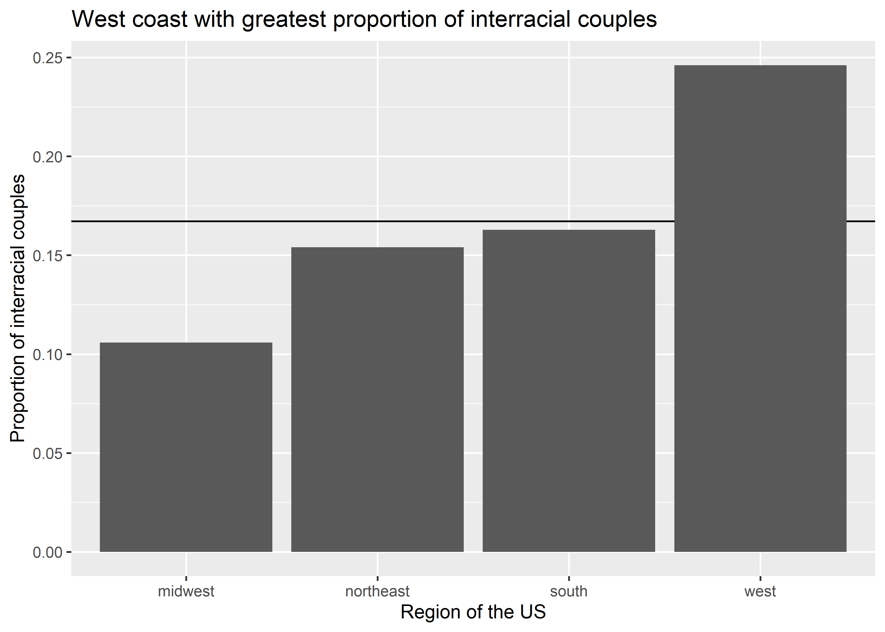<!-- -->

### Proportion of Interracial Couples by Region, Specific

``` r
data_meet_basics %>% 
  drop_na(interracial) %>% 
  count(region_specific, interracial, wt = weight2) %>% 
  group_by(region_specific) %>% 
  mutate(
    prop = n / sum(n)
  ) %>% 
  filter(interracial == "Interracial couple") %>% 
  ggplot(aes(fct_reorder(region_specific, prop), prop)) +
  geom_hline(aes(yintercept = weighted.mean(prop, wt = n))) + 
  geom_col() + 
  theme(axis.text.x = element_text(angle = -45, hjust = 0)) +
  labs(
    x = "Region of the US", 
    y = "Proportion of interracial couples", 
    title = 
      "Pacific and West-South Central with greatest proportion of interracial couples"
  )
```

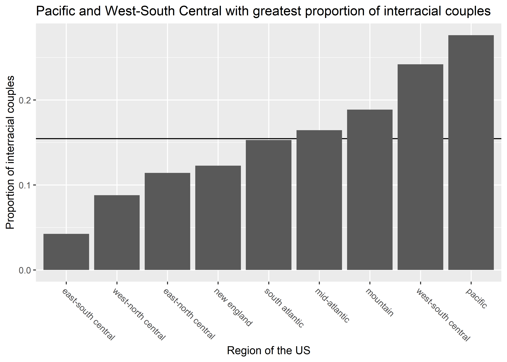<!-- -->

### Breaking down interracial couples, by region

``` r
data_meet_basics %>% 
  filter(
    interracial == "Interracial couple", 
    distinct_pair %in% pairs_wanted
  ) %>% 
  drop_na(interracial) %>% 
  count(region_general, distinct_pair, wt = weight2) %>% 
  group_by(region_general) %>% 
  mutate(
    total = sum(n), 
    prop = n / sum(n)
  ) %>% 
  filter(n > 10) %>% 
  arrange(region_general, distinct_pair, prop) %>% 
  ggplot(aes(fct_reorder(distinct_pair, prop), prop, fill = region_general)) +
  geom_col() +
  facet_grid(vars(region_general)) + 
  labs(
    x = "Interracial couples", 
    y = "Proportion of interracial couples", 
    title = "Interracial couple distribution roughly equal across all regions", 
    fill = "US Regions"
  )
```

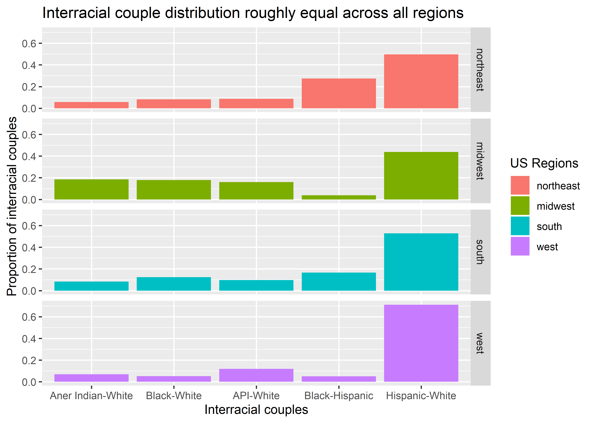<!-- -->
\#\# Same sex vs Different Sex Distributions

When looking at the distributions of interracial pairings within same
sex and different sex couples, it seems that same sex couples tend to
have higher proportions of interracial dating than different sex
couples.

``` r
data_meet_basics %>% 
  drop_na(interracial) %>% 
  count(same_sex_couple, interracial, wt = weight2) %>%
  group_by(same_sex_couple) %>% 
  mutate(
    prop = n / sum(n)
  ) %>% 
  filter(interracial == "Interracial couple") %>% 
  ggplot(aes(same_sex_couple, prop)) +
  geom_col(position = "dodge") + 
  labs(
    x = "Same or Different Sex Couples", 
    y = "Proportion interracial", 
    title = "Prop of interracial couples in same or diff sex groups"
  )
```

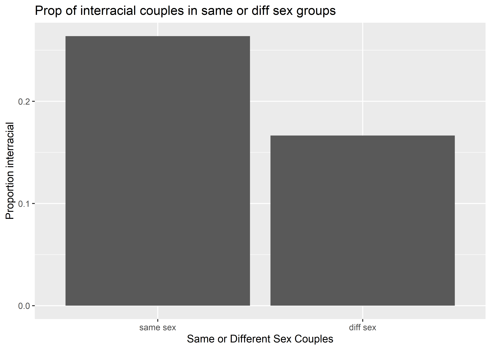<!-- -->

## Basic Demographics of Couples - Age and US raised

General takeaway: Trends in same race do not predict to interracial
pairings. This suggests the presence of separate dating pools for
interracial and same race couples.

### Age diff of couples

``` r
age_diff_function <- function(var, ...) {
  data_meet_basics %>% 
  filter(same_sex_couple == "diff sex", ...) %>% 
  mutate(
    age_diff = 
      case_when(
        r_gender == "M" ~ r_age - p_age, 
        p_gender == "M" ~ p_age - r_age, 
        TRUE ~ r_age - p_age
      ), 
  ) %>% 
  group_by({{var}}) %>% 
  summarize(
    mean_age_diff = weighted.mean(age_diff, wt = weight2, na.rm = TRUE)
  ) %>% 
  ggplot( 
    aes(
      fct_reorder({{var}}, mean_age_diff), 
      mean_age_diff
    )
  ) +
  geom_hline(aes(yintercept = weighted.mean(mean_age_diff, wt = n))) +  
  geom_col()
}
```

### Age diff of couples, same race

``` r
age_diff_function(
  distinct_pair, 
  respondent_race == partner_race, 
   !respondent_race %in% c("AI", "Other")
  ) + 
  labs(
    x = "Same-race Pairs", 
    y = "Weighted mean age difference(Male - Female)",
    title = "Hispanic couples greatest age difference"
  )
```

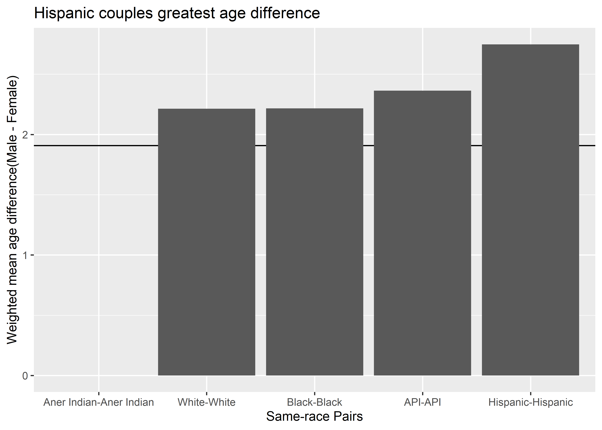<!-- -->

### Age diff of couples, interracial

``` r
age_diff_function(distinct_pair, distinct_pair %in% pairs_wanted) + 
  labs(
    x = "Interracial Pairs", 
    y = "Weighted mean age difference(Male - Female)",
    title = "Hispanic and black couples greatest age difference"
  )
```

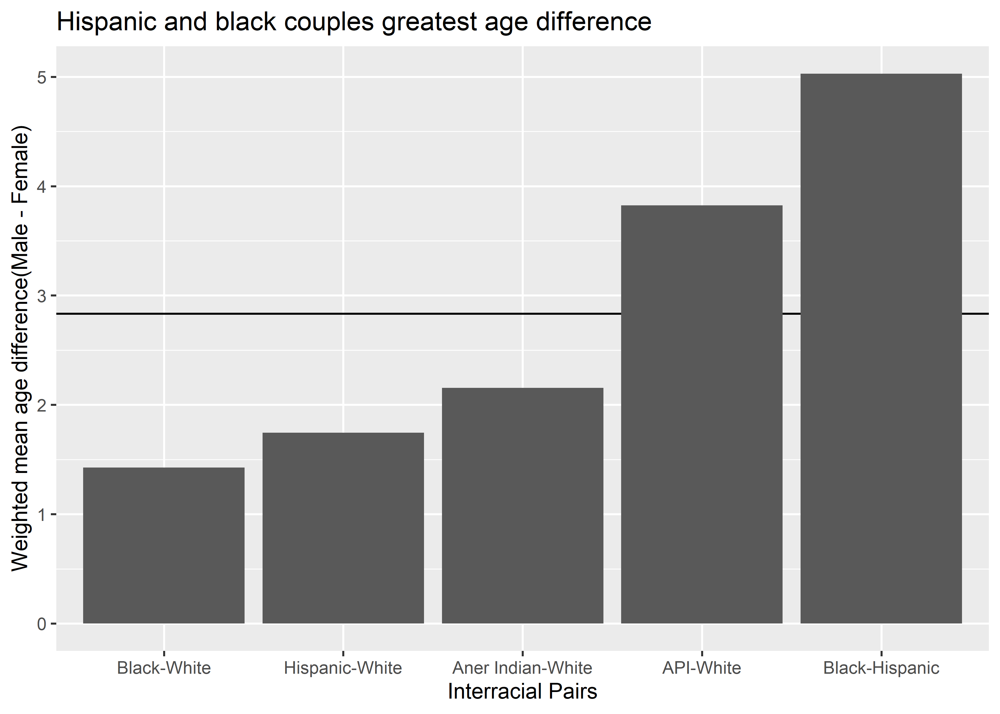<!-- -->

\#\#\#Age of couples, interracial and by gender

``` r
age_diff_function(
  distinct_pair_gender, 
  distinct_pair_gender %in% pairs_gender_wanted
) + 
  theme(axis.text.x = element_text(angle = -45, hjust = 0)) + 
  labs(
    x = "Interracial Pairs by Gender", 
    y = "Weighted mean difference(Male - Female)",
    title = "Black female and Hispanic male couple greatest age difference"
  )
```

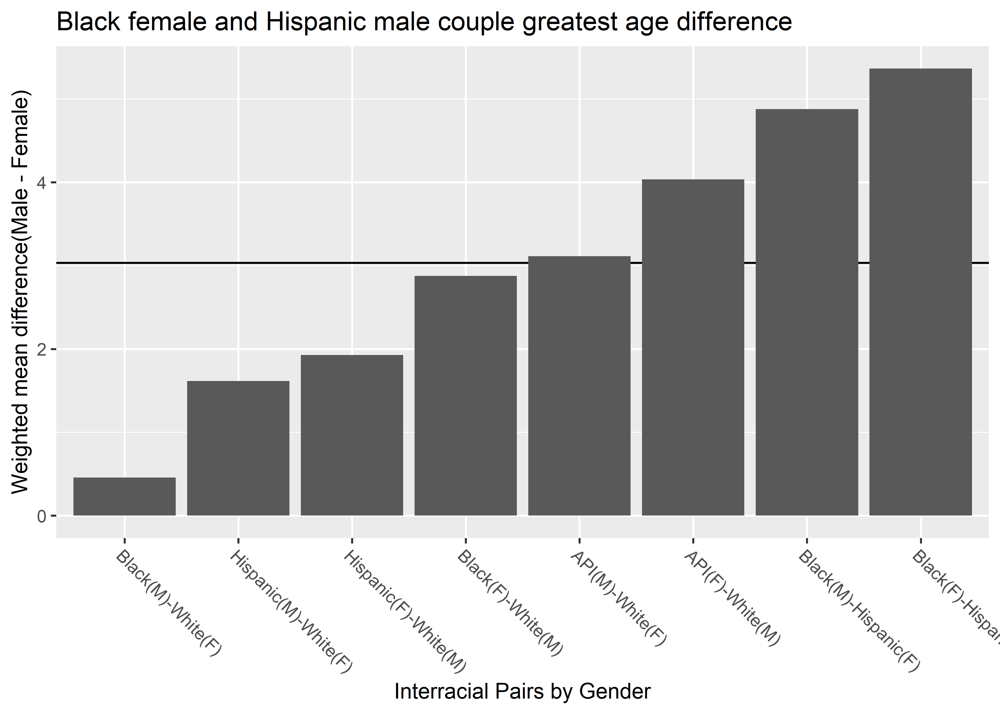<!-- -->

``` r
age_diff_function(
  distinct_pair_gender, 
  distinct_pair %in% c("Black-Hispanic", "Hispanic-Hispanic", "Black-Black"), 
  same_sex_couple == "diff sex"
) + 
  theme(axis.text.x = element_text(angle = -45, hjust = 0)) + 
  labs(
    x = "Interracial Pairs by Gender", 
    y = "Weighted mean difference(Male - Female)",
    title = "B-H couples greatest age difference"
  )
```

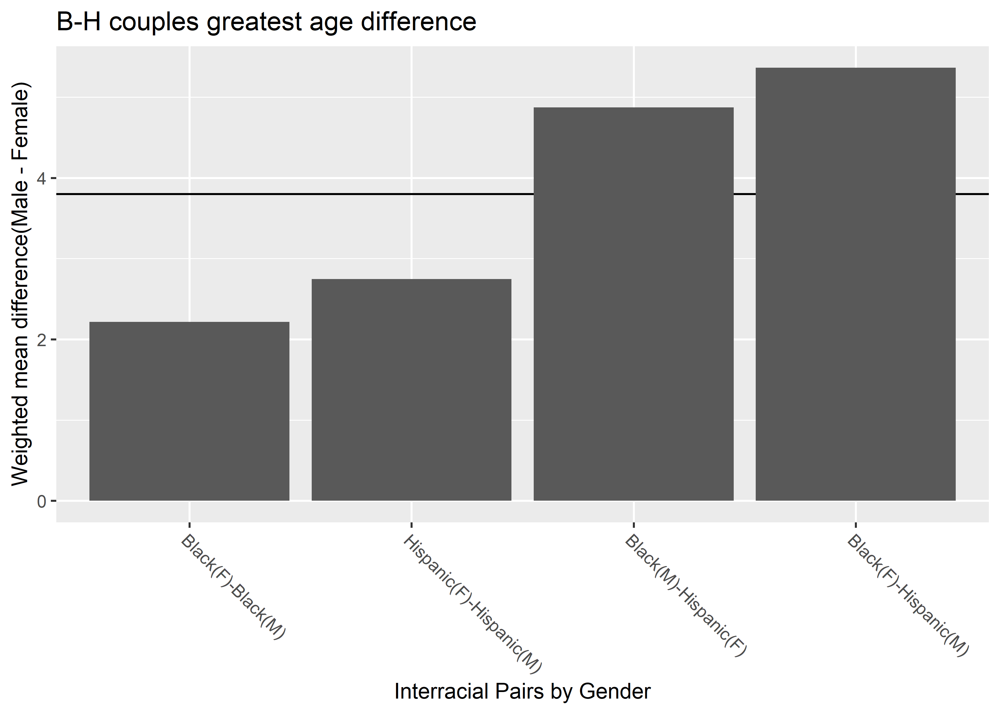<!-- -->

``` r
age_diff_function(
  distinct_pair_gender, 
  distinct_pair %in% c("Black-White", "White-White", "Black-Black"), 
  same_sex_couple == "diff sex"
) + 
  theme(axis.text.x = element_text(angle = -45, hjust = 0)) + 
  labs(
    x = "Interracial Pairs by Gender", 
    y = "Weighted mean difference(Male - Female)",
    title = "Interracial B-W couples greatest variation in age difference"
  )
```

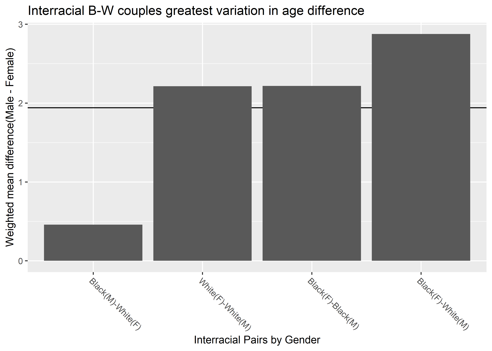<!-- -->

``` r
age_diff_function(
  distinct_pair_gender, 
  distinct_pair %in% c("API-White", "API-API", "White-White"), 
  same_sex_couple == "diff sex"
) + 
  theme(axis.text.x = element_text(angle = -45, hjust = 0)) + 
  labs(
    x = "Interracial Pairs by Gender", 
    y = "Weighted mean difference(Male - Female)",
    title = "Interracial API-W couples greatest age difference"
  )
```

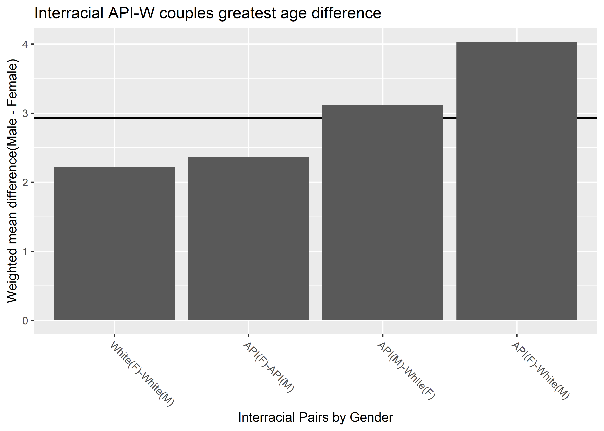<!-- -->

``` r
age_diff_function(
  distinct_pair_gender, 
  distinct_pair %in% c("Hispanic-White", "Hispanic-Hispanic", "White-White"), 
  same_sex_couple == "diff sex"
) + 
  theme(axis.text.x = element_text(angle = -45, hjust = 0)) + 
  labs(
    x = "Interracial Pairs by Gender", 
    y = "Weighted mean difference(Male - Female)",
    title = "Same race Hispanic and White couples greatest age difference"
  )
```

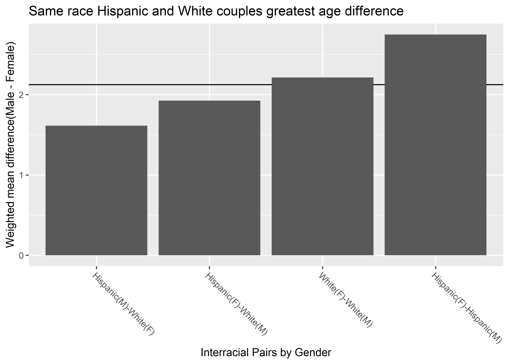<!-- -->
\#\#\# US\_raised respondents

#### Function:

``` r
diff_US_raised_function <- function(var, ...) {
  data_meet_basics %>% 
    filter(same_sex_couple == "diff sex", ...) %>% 
    drop_na(US_raised) %>% 
    count({{var}}, US_raised, wt = weight2) %>% 
    group_by({{var}}) %>% 
    mutate(
      prop = n / sum(n)
    ) %>%
    ungroup() %>% 
    pivot_wider(
      names_from = US_raised, 
      values_from = prop
    ) %>% 
    mutate(
      `raised in US` = 
        if_else(is.na(`raised in US`), 0, `raised in US`), 
      {{var}} := fct_reorder({{var}}, `raised in US`), 
    ) %>% 
    ggplot(aes(x = {{var}}, y = `raised in US`)) +
    geom_hline(aes(yintercept = weighted.mean(`raised in US`, n))) +
    geom_col() 
}
```

``` r
diff_US_raised_function(
  distinct_pair, 
  respondent_race == partner_race, 
  !respondent_race %in% c("AI", "Other")
  ) + 
  labs(
    x = "Proportion raised in US", 
    y = "Same Race couples", 
    title = "White and Black Same Race Respondents Mostly Raised in US", 
    caption = "HCMST 2009"
  )
```

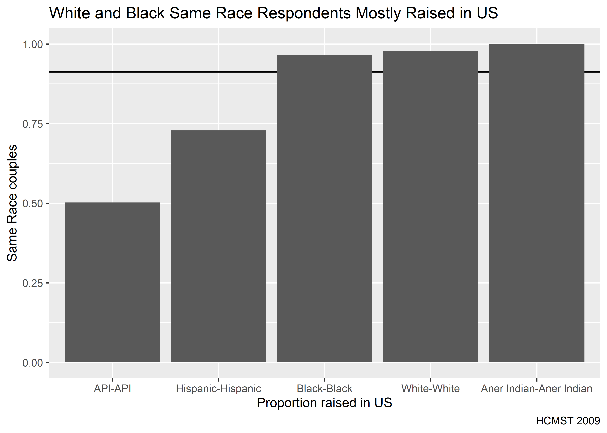<!-- -->

### US\_raised, interracial couples, all

``` r
diff_US_raised_function(distinct_pair, distinct_pair %in% pairs_wanted) + 
  labs(
    x = "Same race couples", 
    y = "Proportion raised in the US", 
    title = "Black and Hispanic Couples Mostly Raised in US", 
    caption = "HCMST 2009"
  )
```

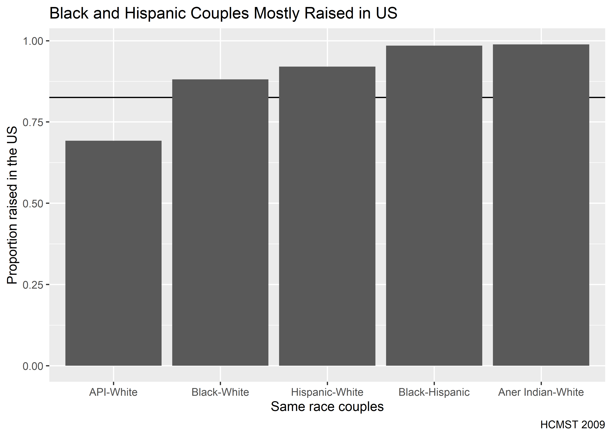<!-- -->

### US\_raised, interracial couples, by gender

``` r
diff_US_raised_function(
  distinct_pair_gender, 
  distinct_pair_gender %in% pairs_gender_wanted
) + 
  theme(axis.text.x = element_text(angle = -45, hjust = 0)) + 
  labs(
    x = "Interracial couples", 
    y = "Proportion raised in the US", 
    title = "Black Male and Hispanic Female Couples Mostly Raised in US", 
    caption = "HCMST 2009"
  )
```

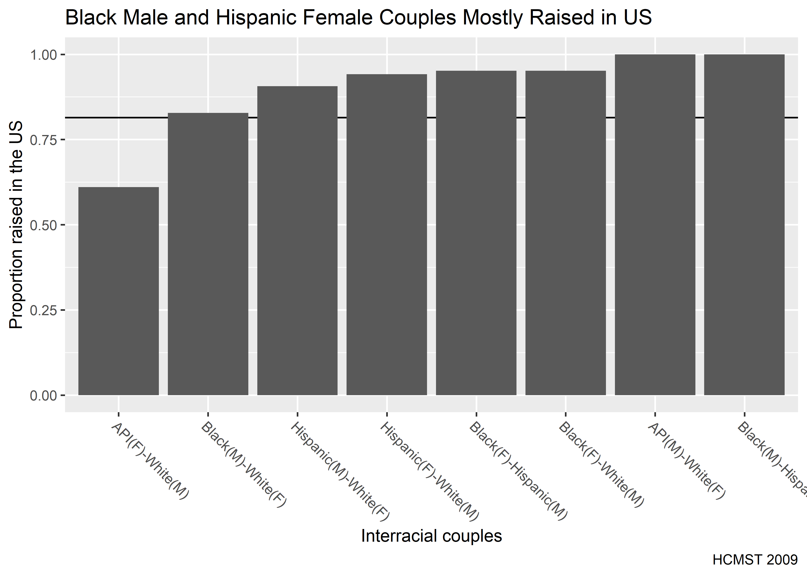<!-- -->

## How couples meet, overall

``` r
data_meet_ways %>% 
  count(type_of_meeting, wt = weight2) %>% 
  mutate(
    prop = n / sum(n), 
    type_of_meeting = fct_reorder(type_of_meeting, prop)
  ) %>% 
  ggplot(aes(fct_reorder(type_of_meeting, prop), prop)) + 
  geom_col() +
  labs(
    x = "How they met", 
    y = "Proportion", 
    title = "Most couples meet through friends, coworkers, and family", 
    caption = "HCMST 2009"
  )
```

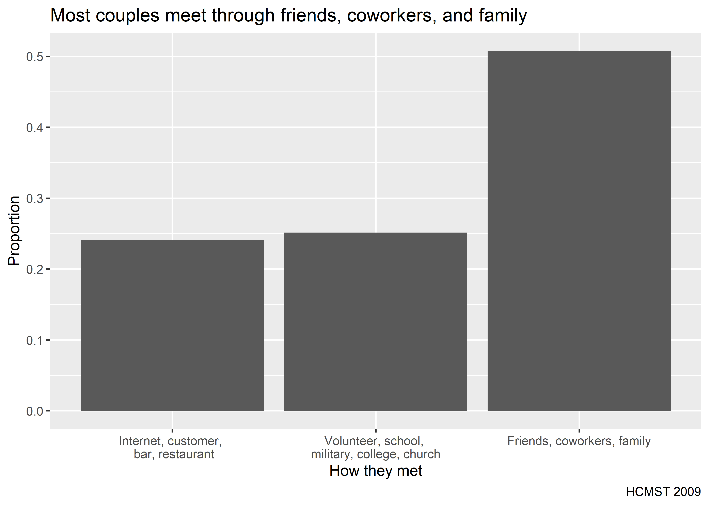<!-- -->

### How couples meet, by region

``` r
data_meet_ways %>% 
  count(region_general, type_of_meeting, wt = weight2) %>%
  group_by(region_general) %>% 
  mutate(
    prop = n / sum(n), 
    type_of_meeting = fct_reorder(type_of_meeting, prop)
  ) %>% 
  ggplot(aes(fct_reorder(type_of_meeting, prop), prop, fill = region_general)) + 
  geom_col(position = "dodge") +
  labs(
    x = "How they met", 
    y = "Proportion", 
    title = 
      "Friends, coworkers, and family most popular avenue regardless of region", 
    caption = "HCMST 2009", 
    fill = "US region"
  )
```

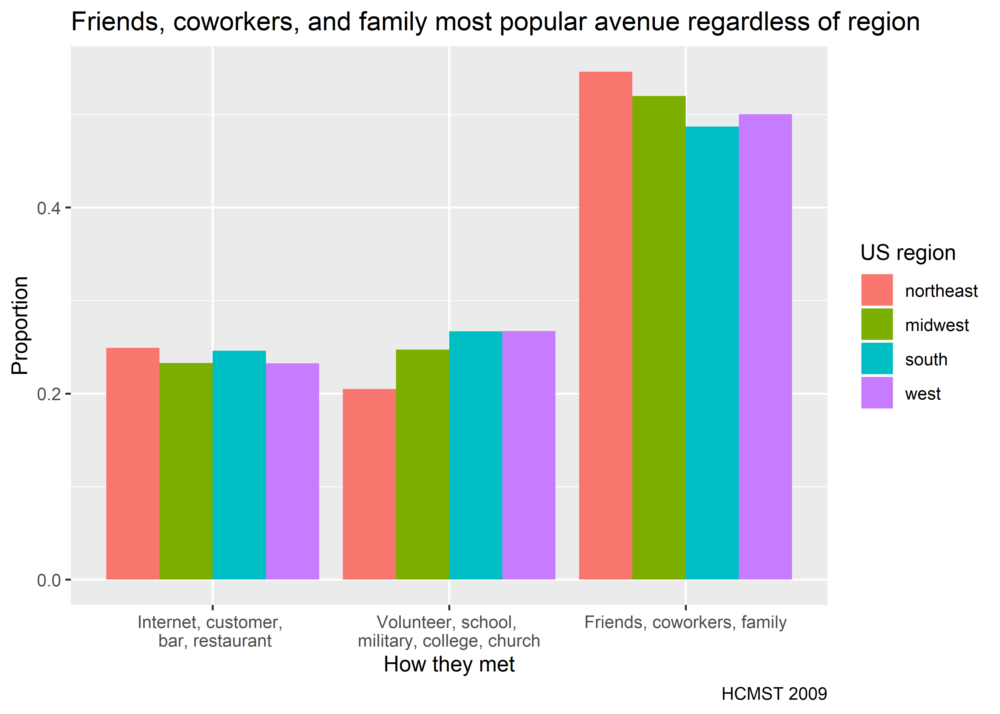<!-- -->

### How couples meet, inter and intraracial

``` r
data_meet_ways %>% 
  count(interracial, type_of_meeting, wt = weight2) %>% 
  group_by(interracial) %>% 
  mutate(
    prop = n / sum(n), 
    type_of_meeting = fct_reorder(type_of_meeting, prop), 
    interracial_prop = if_else(interracial == "Interracial couple", prop, 0)
  ) %>% 
  ggplot(
    aes(
      fct_reorder(type_of_meeting, interracial_prop), 
      prop, 
      color = interracial
      )
  ) + 
  geom_point() +
  geom_line(aes(group = interracial)) +
  labs(
    x = "How they met", 
    y = "Proportion", 
    title = "Differences in interracial couple meetings", 
    caption = "HCMST 2009",
    fill = NULL
  )
```

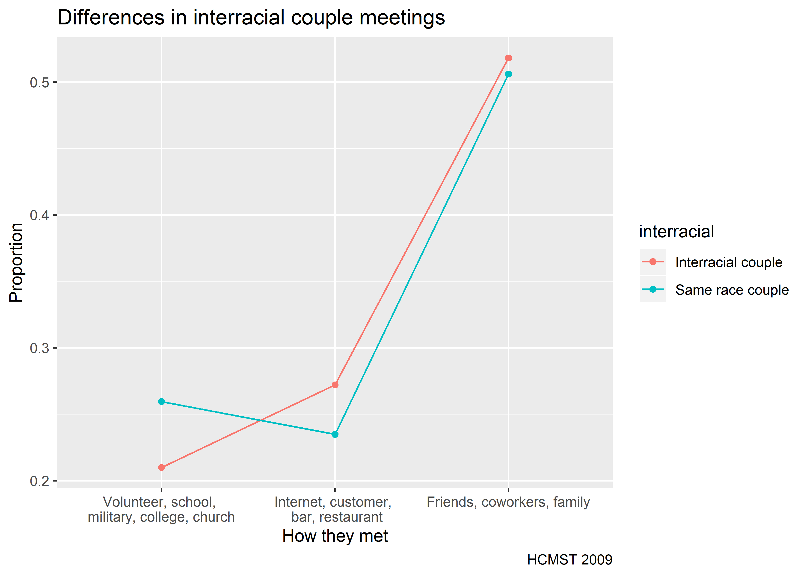<!-- -->
\#\#\# How couples meet, detailed

``` r
 data_meet_ways %>% 
  count(interracial, where_they_met, wt = weight2) %>% 
  group_by(interracial) %>% 
  mutate(
    prop = n / sum(n), 
    interracial_prop = if_else(interracial == "Interracial couple", prop, 0)
  ) %>% 
  ggplot(
    aes(
      fct_reorder(where_they_met, interracial_prop),
      prop, 
      color = interracial)
  ) +
  geom_point() +
  geom_line(aes(group = interracial)) + 
  scale_color_discrete(
    name = NULL, 
    labels = c("Interracial couple", "Same race couple")
  ) + 
  theme(
    axis.text.x = element_text(angle = 45, hjust = 1)
  ) + 
  labs(
    x = "How they met", 
    y = "Proportion", 
    title = "Interracial couples meet more through friends and the internet", 
    caption = "HCMST 2009"
  )
```

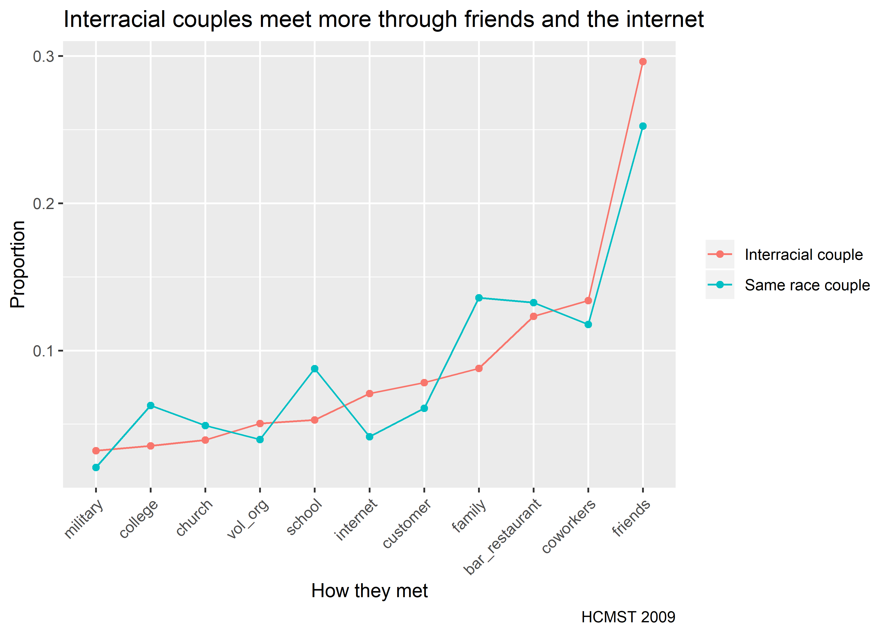<!-- -->
\#\#\# Meeting places, by same-race and different-race pairings

General takeaway: gender affects meeting places as much as race.
Suggestion of different social norms and friend groups.

#### Function

``` r
couples_meet <- function(var, ...) {
  data_meet_ways %>% 
  filter(...) %>% 
  count(type_of_meeting, {{var}}) %>% 
  group_by({{var}}) %>% 
  mutate(
    prop = n / sum(n)
  ) %>% 
  ggplot(aes(fct_reorder({{var}}, prop), prop)) + 
  geom_line(aes(group = type_of_meeting, color = type_of_meeting)) + 
  geom_point(aes(color = type_of_meeting)) +
  theme(axis.text.x = element_text(angle = -45, hjust = 0))
}
```

### Meeting places for all interracial couples

``` r
couples_meet(distinct_pair, distinct_pair %in% pairs_wanted) + 
   labs(
    x = "Interracial Pairs", 
    y = "Proportion", 
    title = "Meeting places, in proportion, by interracial couples", 
    caption = "HCMST 2009",
    color = "Meeting Places"
  )
```

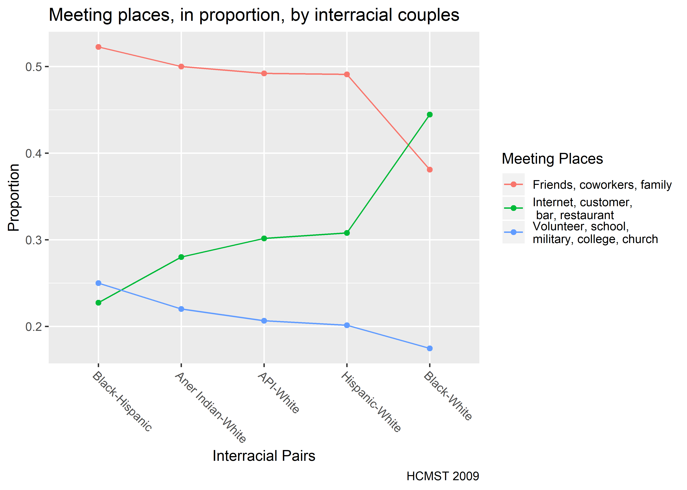<!-- -->

### Black-Hispanic vs Black-Black vs Hispanic-Hispanic by gender

``` r
data_meet_ways %>% 
  filter(
    distinct_pair %in% c("Black-Hispanic", "Hispanic-Hispanic", "Black-Black"), 
    same_sex_couple == "diff sex"
  ) %>% 
  count(type_of_meeting, distinct_pair_gender) %>% 
  group_by(distinct_pair_gender) %>% 
  mutate(
    prop = n / sum(n), 
    friends_prop = 
      if_else(type_of_meeting == "Friends, coworkers, family", prop, 0)
  ) %>% 
  ggplot(
    aes(
      fct_reorder(distinct_pair_gender, friends_prop, .desc = TRUE), 
      prop
    )
  ) + 
  geom_line(aes(group = type_of_meeting, color = type_of_meeting)) + 
  geom_point(aes(color = type_of_meeting)) + 
  theme(axis.text.x = element_text(angle = -45, hjust = 0)) + 
  labs(
    x = "Interracial Pairs", 
    y = "Proportion", 
    title = "Meeting places, in proportion, for Black and Hispanic Couples", 
    caption = "HCMST 2009",
    color = "Meeting Places"
  )
```

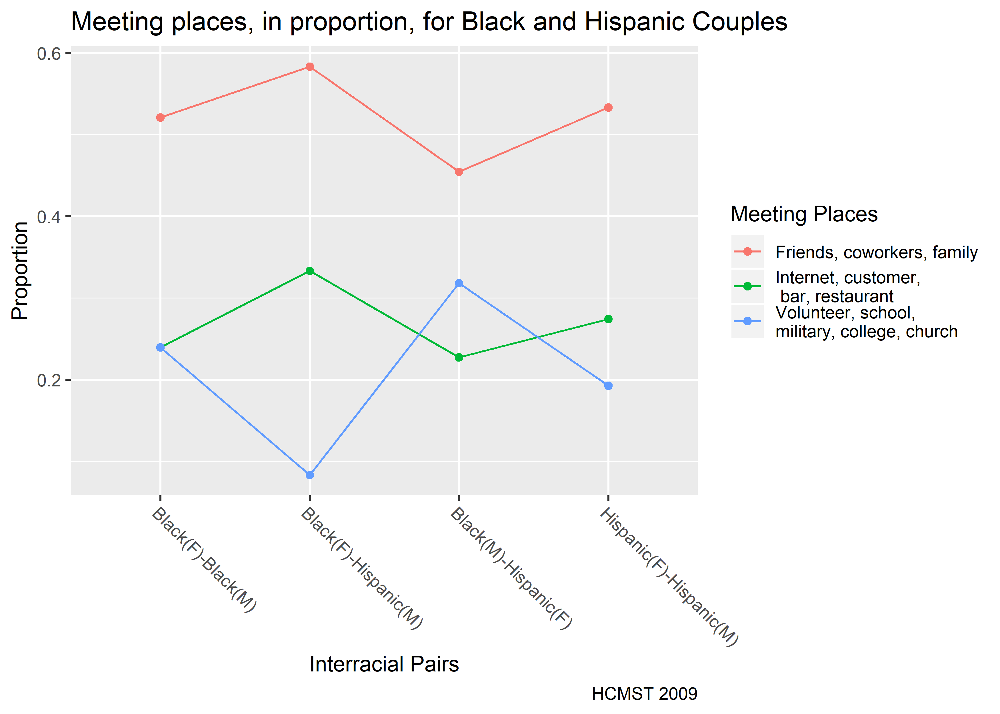<!-- -->

### Black-White vs Black-Black vs White-White by gender

``` r
couples_meet(
  distinct_pair_gender, 
  distinct_pair %in% c("Black-White", "White-White", "Black-Black"), 
  same_sex_couple == "diff sex"
) + 
  labs(
    x = "Interracial Pairs", 
    y = "Proportion", 
    title = "Meeting places, in proportion, for Black and White Couples", 
    caption = "HCMST 2009",
    color = "Meeting Places"
  )
```

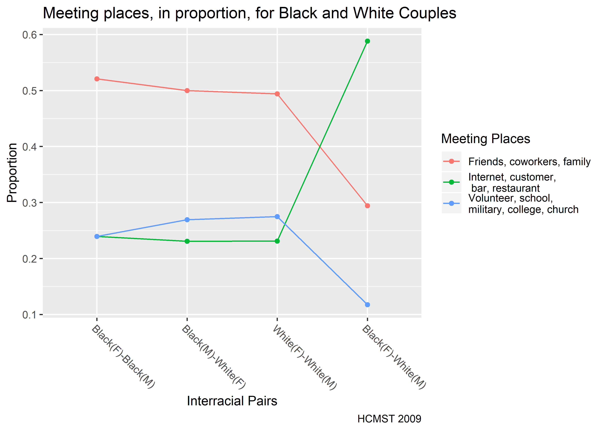<!-- -->
\#\#\# API-White, API-API, White-White by gender

``` r
data_meet_ways %>% 
  filter(
    distinct_pair %in% c("API-White", "API-API", "White-White"), 
    same_sex_couple == "diff sex"
  ) %>% 
  count(type_of_meeting, distinct_pair_gender) %>% 
  group_by(distinct_pair_gender) %>% 
  mutate(
    prop = n / sum(n)
  ) %>% 
  ungroup() %>% 
  add_row(
   type_of_meeting = "Internet, customer, \n bar, restaurant", 
   distinct_pair_gender = "API(M)-White(F)", 
   n = 0, 
   prop = 0
  ) %>%  
  ggplot(aes(fct_reorder(distinct_pair_gender, prop, .desc = TRUE), prop)) + 
  geom_line(aes(group = type_of_meeting, color = type_of_meeting)) + 
  geom_point(aes(color = type_of_meeting))  +
  theme(axis.text.x = element_text(angle = -45, hjust = 0)) + 
  labs(
    x = "Interracial Pairs", 
    y = "Proportion", 
    title = "Meeting places, in proportion, for API and White Couples", 
    caption = "HCMST 2009",
    color = "Meeting Places"
  )
```

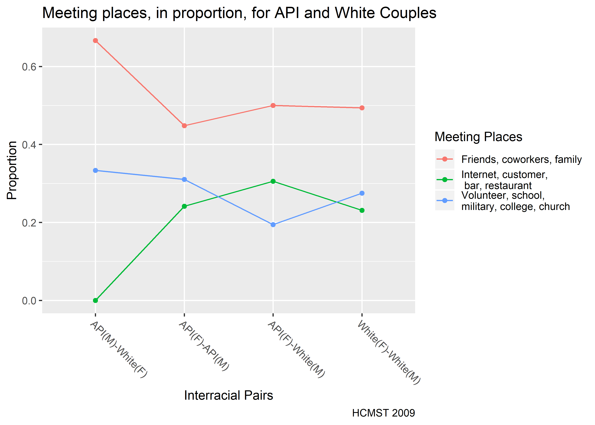<!-- -->
\#\#\# Hispanic-Hispanic, Hispanic-White, White-White by gender

``` r
couples_meet(
  distinct_pair_gender, 
  distinct_pair %in% c("Hispanic-Hispanic", "Hispanic-White", "White-White"), 
  same_sex_couple == "diff sex"
) + 
  labs(
    x = "Interracial Pairs", 
    y = "Proportion", 
    title = "Meeting places, in proportion, for Hispanic and White Couples", 
    caption = "HCMST 2009",
    color = "Meeting Places"
  )
```

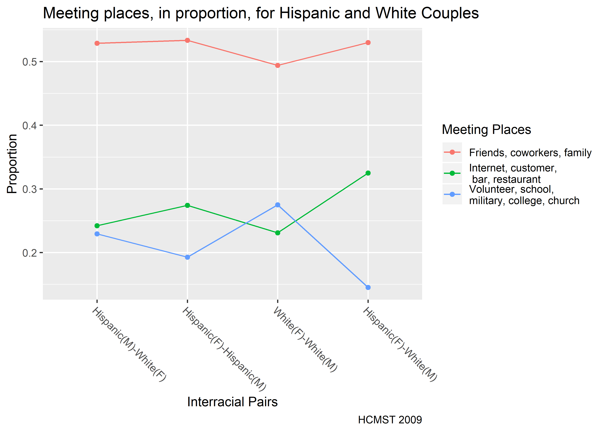<!-- -->
