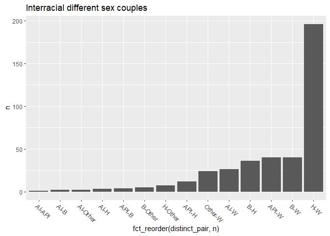

Basic Demographics
================
Angela Zhao
2020-03-29

  - [Data in its full glory](#data-in-its-full-glory)
  - [Different race couples, all distinct without
    NAs](#different-race-couples-all-distinct-without-nas)
      - [Interracial Same-Sex Couples](#interracial-same-sex-couples)
  - [Interracial Different-Sex
    Couples](#interracial-different-sex-couples)
  - [Intraracial Couples](#intraracial-couples)
      - [Intraracial Different-Sex
        Couples](#intraracial-different-sex-couples)
      - [Intraracial Same-Sex Couples](#intraracial-same-sex-couples)

\#Questions

1.  Should the Hispanic identification be removed?
2.  Should it be considered its own race or simply automatically qualify
    the person as part of a multi-racial background?
3.  Some 2+ races categorization also only show up as single race in the
    respondent race category.
4.  Is a NH white and a H white considered interracial?
5.  Currently, using Hispanic as a racial category.

## Data in its full glory

# Different race couples, all distinct without NAs

<!-- -->

## Interracial Same-Sex Couples

<!-- -->

# Interracial Different-Sex Couples

<!-- -->

# Intraracial Couples

<!-- -->

## Intraracial Different-Sex Couples

<!-- -->

## Intraracial Same-Sex Couples

<!-- -->
