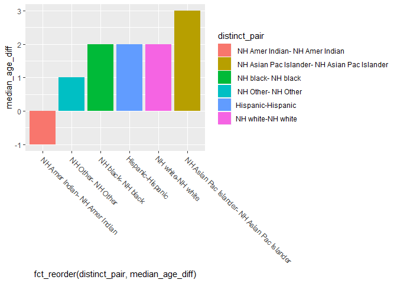
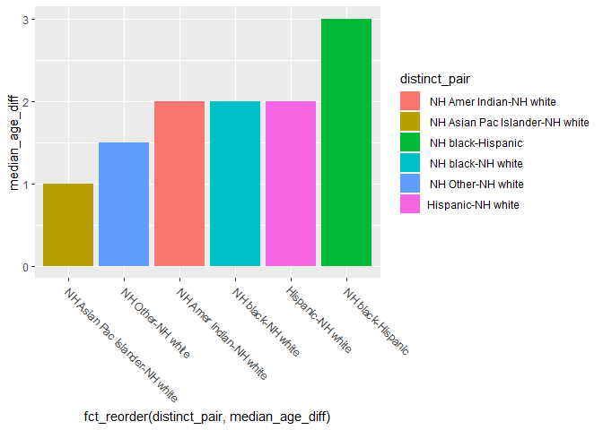
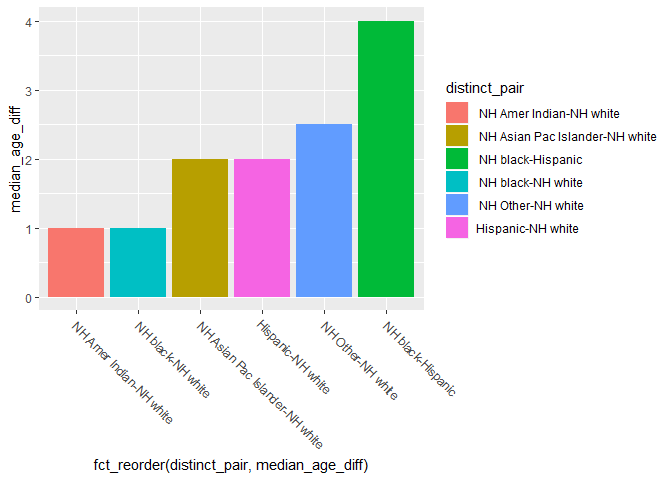
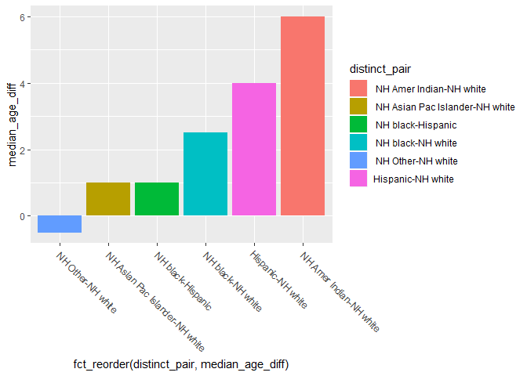
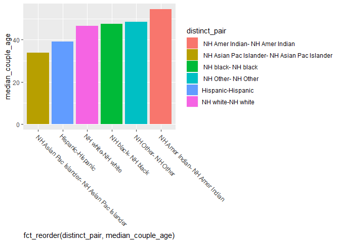
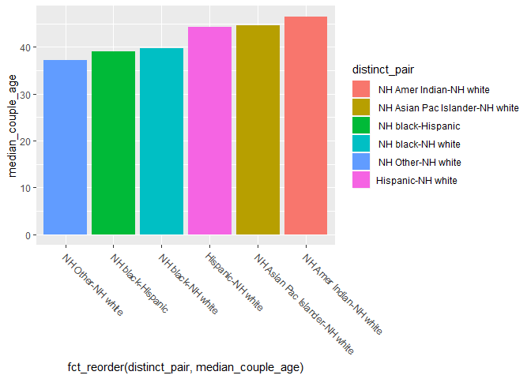
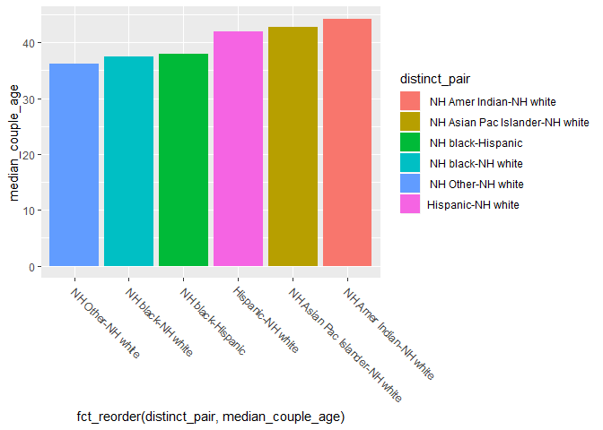
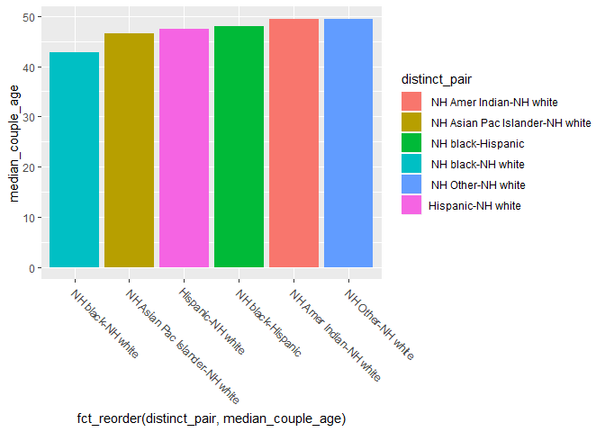

2020-03-29

  - [Read in Data](#read-in-data)

``` r
# Libraries
library(tidyverse)

library(haven)

# Parameters
file_raw <-
  "/Users/angel/GitHub/interracial_dating/data/hcmst_2009.rds"
#===============================================================================

# Code
```

## Read in Data

``` r
#as_factor is the haven version

data_meet <-
  file_raw %>% 
  read_dta() %>% 
  mutate_if(is.labelled, as_factor) 
```

``` r
pairs_wanted <-
  data_meet %>% 
  filter(
    respondent_race != partner_race, 
    qflag != "no spouse or partner or otherwise unqualified", 
    !is.na(respondent_race), 
    !is.na(partner_race)
  ) %>% 
  select(
    respondent_race,
    partner_race,
    weight2, 
  ) %>%
  mutate(
    distinct_pair = 
      str_c(
        pmin(as.character(respondent_race), as.character(partner_race)), 
        "-", 
        pmax(as.character(respondent_race), as.character(partner_race))
      )
  ) %>% 
  count(distinct_pair, wt = weight2) %>% 
  mutate(
    prop = n / sum(n)
  ) %>% 
  filter(prop >= 0.05) %>% 
  count(distinct_pair) %>% 
  pull(distinct_pair)
```

``` r
data_meet_work <-
  data_meet %>% 
  filter(
    qflag != "no spouse or partner or otherwise unqualified", 
    !is.na(respondent_race), 
    !is.na(partner_race), 
    respondent_race != partner_race
  ) %>% 
  mutate(
    distinct_pair = 
      str_c(
        pmin(as.character(respondent_race), as.character(partner_race)), 
        "-", 
        pmax(as.character(respondent_race), as.character(partner_race))
      )
  ) %>% 
  filter(distinct_pair %in% pairs_wanted)
```

\#\#\#Age diff. from men to women in intraracial pairs overall

``` r
data_meet %>% 
  filter(
    respondent_race == partner_race, 
    qflag != "no spouse or partner or otherwise unqualified", 
    !is.na(respondent_race), 
    !is.na(partner_race)
  ) %>% 
  select(
    respondent_race,
    partner_race,
    weight2, 
    r_gender = ppgender,
    r_age = ppage, 
    p_age = q9, 
    same_sex_couple
  ) %>% 
  mutate(
    distinct_pair = 
      str_c(
        pmin(as.character(respondent_race), as.character(partner_race)), 
        "-", 
        pmax(as.character(respondent_race), as.character(partner_race))
      ), 
    r_gender = recode_factor(r_gender, "female" = "F","male" = "M"), 
    same_sex_couple = 
      recode_factor(
        same_sex_couple, 
        "same-sex couple" = "same sex",
        "different sex couple" = "diff sex"
      ), 
    r_age = as.numeric(as.character(r_age)), 
    p_gender = 
      case_when(
        r_gender == "F" & same_sex_couple == "same sex" ~ (p_gender = "F"), 
        r_gender == "M" & same_sex_couple == "same sex" ~ (p_gender = "M"), 
        r_gender == "F" & same_sex_couple != "same sex" ~ (p_gender = "M"), 
        r_gender == "M" & same_sex_couple != "same sex" ~ (p_gender = "F")
      ), 
   age_diff = 
     case_when(
       r_gender == "M" ~ r_age - p_age, 
       p_gender == "M" ~ p_age - r_age, 
       TRUE ~ r_age - p_age
     )
  ) %>% 
  group_by(distinct_pair) %>% 
  summarize(median_age_diff = median(age_diff, wt = weight2, na.rm = TRUE)) %>% 
  ggplot(
    aes(
      fct_reorder(distinct_pair, median_age_diff), 
      median_age_diff, 
      fill = distinct_pair)
  ) +
  geom_col() +
  theme(axis.text.x = element_text(angle = -45, hjust = 0))
```

<!-- -->

\#\#\#Age diff. from men to women in interracial pairs overall

``` r
data_meet_work %>% 
  filter(!is.na(ppage), !is.na(q9)) %>% 
  select(
    respondent_race,
    partner_race,
    weight2, 
    r_gender = ppgender,
    r_age = ppage, 
    p_age = q9, 
    distinct_pair,
    same_sex_couple
  ) %>% 
  mutate(
    r_gender = recode_factor(r_gender, "female" = "F","male" = "M"), 
    same_sex_couple = 
      recode_factor(
        same_sex_couple, 
        "same-sex couple" = "same sex",
        "different sex couple" = "diff sex"
      ), 
    r_age = as.numeric(as.character(r_age)), 
    p_gender = 
      case_when(
        r_gender == "F" & same_sex_couple == "same sex" ~ (p_gender = "F"), 
        r_gender == "M" & same_sex_couple == "same sex" ~ (p_gender = "M"), 
        r_gender == "F" & same_sex_couple != "same sex" ~ (p_gender = "M"), 
        r_gender == "M" & same_sex_couple != "same sex" ~ (p_gender = "F")
      ), 
   age_diff = 
     case_when(
       r_gender == "M" ~ r_age - p_age, 
       p_gender == "M" ~ p_age - r_age, 
       TRUE ~ r_age - p_age
     )
  ) %>% 
  group_by(distinct_pair) %>% 
  summarize(median_age_diff = median(age_diff, wt = weight2, na.rm = TRUE)) %>% 
  ggplot(
    aes(
      fct_reorder(distinct_pair, median_age_diff), 
      median_age_diff, 
      fill = distinct_pair)
  ) +
  geom_col() +
  theme(axis.text.x = element_text(angle = -45, hjust = 0))
```

<!-- -->

\#\#\#Age diff. from men to women in interracial pairs, diff sex couples
only

``` r
data_meet_work %>% 
  filter(!is.na(ppage), !is.na(q9)) %>% 
  select(
    respondent_race,
    partner_race,
    weight2, 
    r_gender = ppgender,
    r_age = ppage, 
    p_age = q9, 
    distinct_pair,
    same_sex_couple
  ) %>% 
  mutate(
    r_gender = recode_factor(r_gender, "female" = "F","male" = "M"), 
    same_sex_couple = 
      recode_factor(
        same_sex_couple, 
        "same-sex couple" = "same sex",
        "different sex couple" = "diff sex"
      ), 
    r_age = as.numeric(as.character(r_age)), 
    p_gender = 
      case_when(
        r_gender == "F" & same_sex_couple == "same sex" ~ (p_gender = "F"), 
        r_gender == "M" & same_sex_couple == "same sex" ~ (p_gender = "M"), 
        r_gender == "F" & same_sex_couple != "same sex" ~ (p_gender = "M"), 
        r_gender == "M" & same_sex_couple != "same sex" ~ (p_gender = "F")
      ), 
   age_diff = 
     case_when(
       r_gender == "M" ~ r_age - p_age, 
       p_gender == "M" ~ p_age - r_age, 
       TRUE ~ r_age - p_age
     )
  ) %>% 
  filter(same_sex_couple != "same sex") %>% 
  group_by(distinct_pair) %>% 
  summarize(median_age_diff = median(age_diff, wt = weight2, na.rm = TRUE)) %>% 
  ggplot(
    aes(
      fct_reorder(distinct_pair, median_age_diff), 
      median_age_diff, 
      fill = distinct_pair)
  ) +
  geom_col() +
  theme(axis.text.x = element_text(angle = -45, hjust = 0))
```

<!-- -->

\#\#\#Age diff. from men to women in interracial pairs, same sex couples
only

``` r
data_meet_work %>% 
  filter(!is.na(ppage), !is.na(q9)) %>% 
  select(
    respondent_race,
    partner_race,
    weight2, 
    r_gender = ppgender,
    r_age = ppage, 
    p_age = q9, 
    distinct_pair,
    same_sex_couple
  ) %>% 
  mutate(
    r_gender = recode_factor(r_gender, "female" = "F","male" = "M"), 
    same_sex_couple = 
      recode_factor(
        same_sex_couple, 
        "same-sex couple" = "same sex",
        "different sex couple" = "diff sex"
      ), 
    r_age = as.numeric(as.character(r_age)), 
    p_gender = 
      case_when(
        r_gender == "F" & same_sex_couple == "same sex" ~ (p_gender = "F"), 
        r_gender == "M" & same_sex_couple == "same sex" ~ (p_gender = "M"), 
        r_gender == "F" & same_sex_couple != "same sex" ~ (p_gender = "M"), 
        r_gender == "M" & same_sex_couple != "same sex" ~ (p_gender = "F")
      ), 
   age_diff = 
     case_when(
       r_gender == "M" ~ r_age - p_age, 
       p_gender == "M" ~ p_age - r_age, 
       TRUE ~ r_age - p_age
     )
  ) %>% 
  filter(same_sex_couple == "same sex") %>% 
  group_by(distinct_pair) %>% 
  summarize(median_age_diff = median(age_diff, wt = weight2, na.rm = TRUE)) %>% 
  ggplot(
    aes(
      fct_reorder(distinct_pair, median_age_diff), 
      median_age_diff, 
      fill = distinct_pair)
  ) +
  geom_col() +
  theme(axis.text.x = element_text(angle = -45, hjust = 0))
```

<!-- -->
\#\#Mean age of intraracial couples overall

``` r
data_meet %>% 
  filter(!is.na(ppage), !is.na(q9), respondent_race == partner_race) %>% 
  select(
    respondent_race,
    partner_race,
    weight2, 
    r_gender = ppgender,
    r_age = ppage, 
    p_age = q9, 
    same_sex_couple
  ) %>% 
  mutate(
     distinct_pair = 
      str_c(
        pmin(as.character(respondent_race), as.character(partner_race)), 
        "-", 
        pmax(as.character(respondent_race), as.character(partner_race))
      ),
    r_gender = recode_factor(r_gender, "female" = "F","male" = "M"), 
    same_sex_couple = 
      recode_factor(
        same_sex_couple, 
        "same-sex couple" = "same sex",
        "different sex couple" = "diff sex"
      ), 
    r_age = as.numeric(as.character(r_age)), 
    p_gender = 
      case_when(
        r_gender == "F" & same_sex_couple == "same sex" ~ (p_gender = "F"), 
        r_gender == "M" & same_sex_couple == "same sex" ~ (p_gender = "M"), 
        r_gender == "F" & same_sex_couple != "same sex" ~ (p_gender = "M"), 
        r_gender == "M" & same_sex_couple != "same sex" ~ (p_gender = "F")
      ), 
   age_couple = (p_age + r_age) / 2
  ) %>% 
  group_by(distinct_pair) %>% 
  summarize(median_couple_age = median(age_couple, wt = weight2, na.rm = TRUE)) %>% 
  ggplot(
    aes(
      fct_reorder(distinct_pair, median_couple_age), 
      median_couple_age, 
      fill = distinct_pair)
  ) +
  geom_col() +
  theme(axis.text.x = element_text(angle = -45, hjust = 0))
```

<!-- -->

\#\#Mean age of intraracial couples overall

``` r
data_meet_work %>% 
  filter(!is.na(ppage), !is.na(q9)) %>% 
  select(
    respondent_race,
    partner_race,
    weight2, 
    r_gender = ppgender,
    r_age = ppage, 
    p_age = q9, 
    distinct_pair,
    same_sex_couple
  ) %>% 
  mutate(
    r_gender = recode_factor(r_gender, "female" = "F","male" = "M"), 
    same_sex_couple = 
      recode_factor(
        same_sex_couple, 
        "same-sex couple" = "same sex",
        "different sex couple" = "diff sex"
      ), 
    r_age = as.numeric(as.character(r_age)), 
    p_gender = 
      case_when(
        r_gender == "F" & same_sex_couple == "same sex" ~ (p_gender = "F"), 
        r_gender == "M" & same_sex_couple == "same sex" ~ (p_gender = "M"), 
        r_gender == "F" & same_sex_couple != "same sex" ~ (p_gender = "M"), 
        r_gender == "M" & same_sex_couple != "same sex" ~ (p_gender = "F")
      ), 
   age_couple = (p_age + r_age) / 2
  ) %>% 
  group_by(distinct_pair) %>% 
  summarize(median_couple_age = median(age_couple, wt = weight2, na.rm = TRUE)) %>% 
  ggplot(
    aes(
      fct_reorder(distinct_pair, median_couple_age), 
      median_couple_age, 
      fill = distinct_pair)
  ) +
  geom_col() +
  theme(axis.text.x = element_text(angle = -45, hjust = 0))
```

<!-- -->

\#\#Mean age of interracial couples, straight

``` r
data_meet_work %>% 
  filter(!is.na(ppage), !is.na(q9)) %>% 
  select(
    respondent_race,
    partner_race,
    weight2, 
    r_gender = ppgender,
    r_age = ppage, 
    p_age = q9, 
    distinct_pair,
    same_sex_couple
  ) %>% 
  mutate(
    r_gender = recode_factor(r_gender, "female" = "F","male" = "M"), 
    same_sex_couple = 
      recode_factor(
        same_sex_couple, 
        "same-sex couple" = "same sex",
        "different sex couple" = "diff sex"
      ), 
    r_age = as.numeric(as.character(r_age)), 
    p_gender = 
      case_when(
        r_gender == "F" & same_sex_couple == "same sex" ~ (p_gender = "F"), 
        r_gender == "M" & same_sex_couple == "same sex" ~ (p_gender = "M"), 
        r_gender == "F" & same_sex_couple != "same sex" ~ (p_gender = "M"), 
        r_gender == "M" & same_sex_couple != "same sex" ~ (p_gender = "F")
      ), 
   age_couple = (p_age + r_age) / 2
  ) %>% 
  filter(same_sex_couple != "same sex") %>% 
  group_by(distinct_pair) %>% 
  summarize(median_couple_age = median(age_couple, wt = weight2, na.rm = TRUE)) %>% 
  ggplot(
    aes(
      fct_reorder(distinct_pair, median_couple_age), 
      median_couple_age, 
      fill = distinct_pair)
  ) +
  geom_col() +
  theme(axis.text.x = element_text(angle = -45, hjust = 0))
```

<!-- -->
\#\#Interracial couples, same sex, couple mean age

``` r
data_meet_work %>% 
  filter(!is.na(ppage), !is.na(q9)) %>% 
  select(
    respondent_race,
    partner_race,
    weight2, 
    r_gender = ppgender,
    r_age = ppage, 
    p_age = q9, 
    distinct_pair,
    same_sex_couple
  ) %>% 
  mutate(
    r_gender = recode_factor(r_gender, "female" = "F","male" = "M"), 
    same_sex_couple = 
      recode_factor(
        same_sex_couple, 
        "same-sex couple" = "same sex",
        "different sex couple" = "diff sex"
      ), 
    r_age = as.numeric(as.character(r_age)), 
    p_gender = 
      case_when(
        r_gender == "F" & same_sex_couple == "same sex" ~ (p_gender = "F"), 
        r_gender == "M" & same_sex_couple == "same sex" ~ (p_gender = "M"), 
        r_gender == "F" & same_sex_couple != "same sex" ~ (p_gender = "M"), 
        r_gender == "M" & same_sex_couple != "same sex" ~ (p_gender = "F")
      ), 
   age_couple = (p_age + r_age) / 2
  ) %>% 
  filter(same_sex_couple == "same sex") %>% 
  group_by(distinct_pair) %>% 
  summarize(median_couple_age = median(age_couple, wt = weight2, na.rm = TRUE)) %>% 
  ggplot(
    aes(
      fct_reorder(distinct_pair, median_couple_age), 
      median_couple_age, 
      fill = distinct_pair)
  ) +
  geom_col() +
  theme(axis.text.x = element_text(angle = -45, hjust = 0))
```

<!-- -->
