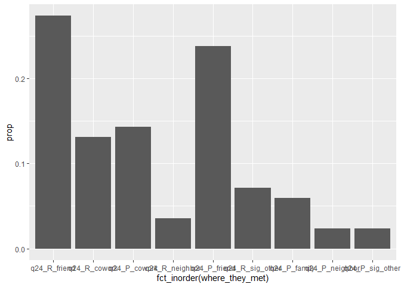
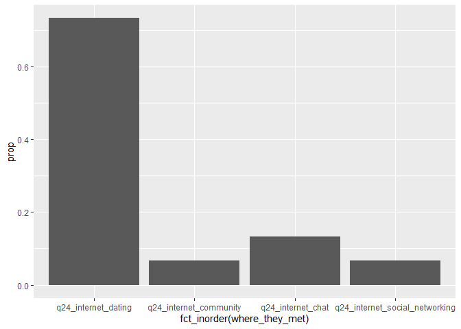
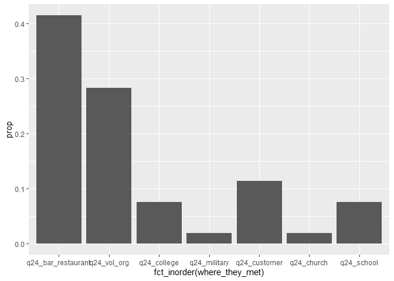

Interracial Straight Couples Meet
================
Angela Zhao
2020-03-29

  - [Data in its full glory](#data-in-its-full-glory)
  - [Interracial Couples, Gay](#interracial-couples-gay)
      - [Met through Family or Friends](#met-through-family-or-friends)
      - [Met through Internet](#met-through-internet)

``` r
# Libraries
library(tidyverse)

library(haven)

# Parameters
file_raw <-
  "/Users/angel/GitHub/interracial_dating/data/hcmst_2009.rds"
#===============================================================================

# Code
```

## Data in its full glory

``` r
#as_factor is the haven version

data_meet <-
  file_raw %>% 
  read_dta() %>% 
  mutate_if(is.labelled, as_factor) 

glimpse(data_meet)
```

    ## Observations: 4,002
    ## Variables: 387
    ## $ caseid_new                       <dbl> 22526, 23286, 25495, 26315, 27355,...
    ## $ weight1                          <dbl> 4265, 16485, 52464, 4575, 12147, 1...
    ## $ weight2                          <dbl> 4265, 16485, NA, 4575, NA, NA, 192...
    ## $ ppage                            <fct> 52, 28, 49, 31, 35, 69, 53, 58, 39...
    ## $ ppagecat                         <fct> 45-54, 25-34, 45-54, 25-34, 35-44,...
    ## $ ppagect4                         <fct> 45-59, 18-29, 45-59, 30-44, 30-44,...
    ## $ ppeduc                           <fct> "bachelors degree", "masters degre...
    ## $ ppeducat                         <fct> bachelor's degree or higher, bache...
    ## $ ppethm                           <fct> "hispanic", "white, non-hispanic",...
    ## $ ppgender                         <fct> female, female, female, male, male...
    ## $ pphhhead                         <fct> yes, yes, yes, yes, yes, yes, yes,...
    ## $ pphouseholdsize                  <dbl> 2, 2, 4, 1, 2, 1, 2, 1, 1, 4, 2, 2...
    ## $ pphouse                          <fct> a building with 2 or more apartmen...
    ## $ ppincimp                         <fct> "$20,000 to $24,999", "$40,000 to ...
    ## $ hhinc                            <dbl> 22250, 45000, 37250, 45000, 45000,...
    ## $ ppmarit                          <fct> living with partner, living with p...
    ## $ ppmsacat                         <fct> metro, metro, metro, metro, metro,...
    ## $ ppreg4                           <fct> midwest, west, south, south, south...
    ## $ ppreg9                           <fct> east-north central, pacific, west-...
    ## $ pprent                           <fct> rented for cash, rented for cash, ...
    ## $ ppt01                            <fct> 0, 0, 0, 0, 0, 0, 0, 0, 0, 0, 0, 0...
    ## $ ppt1317                          <fct> 0, 0, 1, 0, 0, 0, 0, 0, 0, 0, 0, 0...
    ## $ ppt18ov                          <fct> 2, 2, 1, 2, 2, 1, 2, 1, 1, 3, 2, 2...
    ## $ ppt25                            <fct> 0, 0, 0, 0, 0, 0, 0, 0, 0, 0, 0, 0...
    ## $ ppt612                           <fct> 0, 0, 0, 0, 0, 0, 0, 0, 0, 0, 0, 0...
    ## $ children_in_hh                   <dbl> 0, 0, 1, 0, 0, 0, 0, 0, 0, 0, 0, 0...
    ## $ ppwork                           <fct> working - as a paid employee, work...
    ## $ ppnet                            <fct> yes, yes, yes, yes, yes, yes, yes,...
    ## $ ppq14arace                       <fct> not asked, not asked, not asked, n...
    ## $ pphispan                         <fct> "yes, other spanish/hispanic/latin...
    ## $ pprace_white                     <fct> yes, yes, no, yes, yes, yes, yes, ...
    ## $ pprace_black                     <fct> no, no, yes, no, no, no, no, no, n...
    ## $ pprace_nativeamerican            <fct> no, no, no, no, no, no, no, no, no...
    ## $ pprace_asianindian               <fct> no, no, no, no, no, no, no, no, no...
    ## $ pprace_chinese                   <fct> no, no, no, no, no, no, no, no, no...
    ## $ pprace_filipino                  <fct> no, no, no, no, no, no, no, no, no...
    ## $ pprace_japanese                  <fct> no, no, no, no, no, no, no, no, no...
    ## $ pprace_korean                    <fct> no, no, no, no, no, no, no, no, no...
    ## $ pprace_vietnamese                <fct> no, no, no, no, no, no, no, no, no...
    ## $ pprace_otherasian                <fct> no, no, no, no, no, no, no, no, no...
    ## $ pprace_hawaiian                  <fct> no, no, no, no, no, no, no, no, no...
    ## $ pprace_guamanian                 <fct> no, no, no, no, no, no, no, no, no...
    ## $ pprace_samoan                    <fct> no, no, no, no, no, no, no, no, no...
    ## $ pprace_otherpacificislander      <fct> no, no, no, no, no, no, no, no, no...
    ## $ pprace_someotherrace             <fct> no, no, no, no, no, no, no, no, no...
    ## $ papglb_friend                    <fct> "yes, friends", "yes, both", "yes,...
    ## $ pppartyid3                       <fct> democrat, democrat, democrat, demo...
    ## $ papevangelical                   <fct> yes, no, yes, no, no, no, no, no, ...
    ## $ papreligion                      <fct> "catholic", "jewish", "baptist-any...
    ## $ ppppcmdate_yrmo                  <dbl> 200711, 200711, 200711, 200710, 20...
    ## $ pppadate_yrmo                    <dbl> 200709, 200709, 200709, 200709, 20...
    ## $ pphhcomp11_member2_age           <dbl> 47, 29, 22, NA, 63, NA, 54, NA, NA...
    ## $ pphhcomp11_member3_age           <dbl> NA, NA, 15, NA, NA, NA, NA, NA, NA...
    ## $ pphhcomp11_member4_age           <dbl> NA, NA, 39, NA, NA, NA, NA, NA, NA...
    ## $ pphhcomp11_member5_age           <dbl> NA, NA, NA, NA, NA, NA, NA, NA, NA...
    ## $ pphhcomp11_member6_age           <dbl> NA, NA, NA, NA, NA, NA, NA, NA, NA...
    ## $ pphhcomp11_member7_age           <dbl> NA, NA, NA, NA, NA, NA, NA, NA, NA...
    ## $ pphhcomp11_member8_age           <dbl> NA, NA, NA, NA, NA, NA, NA, NA, NA...
    ## $ pphhcomp11_member9_age           <dbl> NA, NA, NA, NA, NA, NA, NA, NA, NA...
    ## $ pphhcomp11_member10_age          <dbl> NA, NA, NA, NA, NA, NA, NA, NA, NA...
    ## $ pphhcomp11_member11_age          <dbl> NA, NA, NA, NA, NA, NA, NA, NA, NA...
    ## $ pphhcomp11_member12_age          <dbl> NA, NA, NA, NA, NA, NA, NA, NA, NA...
    ## $ pphhcomp11_member13_age          <dbl> NA, NA, NA, NA, NA, NA, NA, NA, NA...
    ## $ pphhcomp11_member14_age          <dbl> NA, NA, NA, NA, NA, NA, NA, NA, NA...
    ## $ pphhcomp11_member15_age          <dbl> NA, NA, NA, NA, NA, NA, NA, NA, NA...
    ## $ pphhcomp11_member2_gender        <fct> female, female, female, NA, male, ...
    ## $ pphhcomp11_member3_gender        <fct> NA, NA, male, NA, NA, NA, NA, NA, ...
    ## $ pphhcomp11_member4_gender        <fct> NA, NA, female, NA, NA, NA, NA, NA...
    ## $ pphhcomp11_member5_gender        <fct> NA, NA, NA, NA, NA, NA, NA, NA, NA...
    ## $ pphhcomp11_member6_gender        <fct> NA, NA, NA, NA, NA, NA, NA, NA, NA...
    ## $ pphhcomp11_member7_gender        <fct> NA, NA, NA, NA, NA, NA, NA, NA, NA...
    ## $ pphhcomp11_member8_gender        <fct> NA, NA, NA, NA, NA, NA, NA, NA, NA...
    ## $ pphhcomp11_member9_gender        <fct> NA, NA, NA, NA, NA, NA, NA, NA, NA...
    ## $ pphhcomp11_member10_gender       <fct> NA, NA, NA, NA, NA, NA, NA, NA, NA...
    ## $ pphhcomp11_member11_gender       <fct> NA, NA, NA, NA, NA, NA, NA, NA, NA...
    ## $ pphhcomp11_member12_gender       <fct> NA, NA, NA, NA, NA, NA, NA, NA, NA...
    ## $ pphhcomp11_member13_gender       <fct> NA, NA, NA, NA, NA, NA, NA, NA, NA...
    ## $ pphhcomp11_member14_gender       <fct> NA, NA, NA, NA, NA, NA, NA, NA, NA...
    ## $ pphhcomp11_member15_gender       <fct> NA, NA, NA, NA, NA, NA, NA, NA, NA...
    ## $ pphhcomp11_member2_relationship  <fct> "unmarried partner", "spouse", "ch...
    ## $ pphhcomp11_member3_relationship  <fct> NA, NA, "child (biological, adopte...
    ## $ pphhcomp11_member4_relationship  <fct> NA, NA, other relative, NA, NA, NA...
    ## $ pphhcomp11_member5_relationship  <fct> NA, NA, NA, NA, NA, NA, NA, NA, NA...
    ## $ pphhcomp11_member6_relationship  <fct> NA, NA, NA, NA, NA, NA, NA, NA, NA...
    ## $ pphhcomp11_member7_relationship  <fct> NA, NA, NA, NA, NA, NA, NA, NA, NA...
    ## $ pphhcomp11_member8_relationship  <fct> NA, NA, NA, NA, NA, NA, NA, NA, NA...
    ## $ pphhcomp11_member9_relationship  <fct> NA, NA, NA, NA, NA, NA, NA, NA, NA...
    ## $ pphhcomp11_member10_relationship <fct> NA, NA, NA, NA, NA, NA, NA, NA, NA...
    ## $ pphhcomp11_member11_relationship <fct> NA, NA, NA, NA, NA, NA, NA, NA, NA...
    ## $ pphhcomp11_member12_relationship <fct> NA, NA, NA, NA, NA, NA, NA, NA, NA...
    ## $ pphhcomp11_member13_relationship <fct> NA, NA, NA, NA, NA, NA, NA, NA, NA...
    ## $ pphhcomp11_member14_relationship <fct> NA, NA, NA, NA, NA, NA, NA, NA, NA...
    ## $ pphhcomp11_member15_relationship <fct> NA, NA, NA, NA, NA, NA, NA, NA, NA...
    ## $ irb_consent                      <fct> "yes, i agree to participate", "ye...
    ## $ weight3                          <dbl> 4265, 16485, NA, 4575, NA, NA, 192...
    ## $ weight4                          <dbl> 5618, 8383, 50691, 8656, 26016, 22...
    ## $ weight5                          <dbl> 7505, 11198, NA, 11562, NA, NA, 23...
    ## $ weight6                          <dbl> 3576, 10241, NA, 10270, NA, 1725, ...
    ## $ weight7                          <dbl> 3576, 10241, NA, 10270, NA, NA, 15...
    ## $ weight_couples_coresident        <dbl> 634.3542, 9589.9062, NA, NA, NA, N...
    ## $ HCMST_main_interview_yrmo        <dbl> 200902, 200902, 200902, 200902, 20...
    ## $ duration                         <dbl> 20, 13, 0, 9, 1, 0, 8, 9, 0, 8730,...
    ## $ qflag                            <fct> partnered, partnered, no spouse or...
    ## $ glbstatus                        <fct> glb, glb, not glb, glb, glb, glb, ...
    ## $ papglb_status                    <fct> yes, yes, no, yes, i would prefer ...
    ## $ recsource                        <fct> glb augment sample, glb augment sa...
    ## $ s1                               <fct> "no, i am not married", "yes, i am...
    ## $ s1a                              <fct> NA, NA, NA, NA, yes, NA, NA, NA, N...
    ## $ s2                               <fct> "yes, i have a sexual partner (boy...
    ## $ q3_codes                         <fct> NA, NA, NA, NA, NA, NA, NA, NA, NA...
    ## $ q4                               <fct> female, female, NA, male, NA, NA, ...
    ## $ q5                               <fct> "yes, we are a same-sex couple", "...
    ## $ q6a                              <fct> no (not latino or hispanic), no (n...
    ## $ q6b                              <fct> white, white, NA, white, NA, NA, w...
    ## $ q7a                              <fct> no, no, NA, no, NA, NA, no, no, NA...
    ## $ q7b                              <fct> "protestant (e.g. methodist, luthe...
    ## $ q8a                              <fct> "yes, the same", "no, has changed ...
    ## $ q8b                              <fct> NA, "other christian", NA, "none",...
    ## $ q9                               <dbl> 48, 30, NA, 40, NA, NA, 55, 51, NA...
    ## $ q10                              <fct> "associate degree", "bachelor's de...
    ## $ q11                              <fct> "hs graduate or ged", "bachelor's ...
    ## $ q12                              <fct> democrat, democrat, NA, democrat, ...
    ## $ q13a                             <fct> "no, i have changed religions", "n...
    ## $ q13b                             <fct> "protestant (e.g. methodist, luthe...
    ## $ q14                              <fct> "bachelor's degree", "professional...
    ## $ q15a1_compressed                 <fct> United States, United States, NA, ...
    ## $ q16                              <fct> 0, 0, NA, 1, NA, NA, 1, 0, NA, 8, ...
    ## $ q17a                             <fct> NA, once (this is my first marriag...
    ## $ q17b                             <fct> once, NA, NA, never married, NA, N...
    ## $ q17c                             <fct> "i am mostly sexually attracted to...
    ## $ q17d                             <fct> NA, NA, NA, "i am sexually attract...
    ## $ gender_attraction                <fct> same gender mostly, both genders e...
    ## $ q18a_1                           <fct> no, yes, NA, no, NA, NA, no, NA, N...
    ## $ q18a_2                           <fct> no, no, NA, no, NA, NA, no, NA, NA...
    ## $ q18a_3                           <fct> have neither DP nor CU, have eithe...
    ## $ q18a_refused                     <fct> no, no, NA, no, NA, NA, no, NA, NA...
    ## $ q18b_codes                       <fct> NA, NA, NA, NA, NA, NA, NA, NA, NA...
    ## $ q18c_codes                       <fct> NA, NA, NA, NA, NA, NA, NA, NA, NA...
    ## $ q19                              <fct> yes, yes, NA, no, NA, NA, yes, no,...
    ## $ q20                              <fct> NA, NA, NA, yes, NA, NA, NA, yes, ...
    ## $ q21a                             <dbl> 45, 19, NA, 23, NA, NA, 41, 28, NA...
    ## $ q21a_refusal                     <fct> NA, NA, NA, NA, NA, NA, NA, NA, NA...
    ## $ q21b                             <dbl> 45, 20, NA, 23, NA, NA, 41, 28, NA...
    ## $ q21b_refusal                     <fct> NA, NA, NA, NA, NA, NA, NA, NA, NA...
    ## $ q21c                             <dbl> 45, 22, NA, 23, NA, NA, 41, 30, NA...
    ## $ q21c_refusal                     <fct> NA, NA, NA, NA, NA, NA, NA, NA, NA...
    ## $ q21d                             <dbl> NA, 23, NA, NA, NA, NA, NA, 30, NA...
    ## $ q21d_refusal                     <fct> NA, NA, NA, NA, NA, NA, NA, NA, NA...
    ## $ q21e                             <dbl> NA, 26, NA, NA, NA, NA, NA, NA, NA...
    ## $ q21e_refusal                     <fct> NA, NA, NA, NA, NA, NA, NA, NA, NA...
    ## $ q22                              <fct> NA, NA, NA, NA, NA, NA, NA, NA, NA...
    ## $ q23                              <fct> partner earned more, i earned more...
    ## $ q24_codes                        <fct> NA, NA, NA, NA, NA, NA, NA, NA, NA...
    ## $ q25                              <fct> different high school, different h...
    ## $ q26                              <fct> did not attend same college or uni...
    ## $ q27                              <fct> no, no, NA, no, NA, NA, no, no, NA...
    ## $ q28                              <fct> no, no, NA, no, NA, NA, no, no, NA...
    ## $ q29                              <fct> neither father nor mother are aliv...
    ## $ q30                              <fct> NA, disapprove, NA, approve, NA, N...
    ## $ q31_1                            <fct> no, no, NA, no, NA, NA, no, yes, N...
    ## $ q31_2                            <fct> no, yes, NA, no, NA, NA, no, no, N...
    ## $ q31_3                            <fct> no, no, NA, no, NA, NA, no, no, NA...
    ## $ q31_4                            <fct> yes, no, NA, no, NA, NA, no, no, N...
    ## $ q31_5                            <fct> no, no, NA, no, NA, NA, no, no, NA...
    ## $ q31_6                            <fct> no, no, NA, no, NA, NA, no, no, NA...
    ## $ q31_7                            <fct> no, no, NA, no, NA, NA, no, no, NA...
    ## $ q31_8                            <fct> no, no, NA, no, NA, NA, no, no, NA...
    ## $ q31_9                            <fct> no, no, NA, yes, NA, NA, yes, no, ...
    ## $ q31_other_text_entered           <fct> No, No, NA, Yes, NA, NA, Yes, No, ...
    ## $ q32                              <fct> "yes, a different kind of internet...
    ## $ q33_1                            <fct> refused, no, NA, no, NA, NA, no, n...
    ## $ q33_2                            <fct> refused, no, NA, yes, NA, NA, no, ...
    ## $ q33_3                            <fct> refused, no, NA, no, NA, NA, no, y...
    ## $ q33_4                            <fct> refused, yes, NA, no, NA, NA, no, ...
    ## $ q33_5                            <fct> refused, no, NA, no, NA, NA, no, n...
    ## $ q33_6                            <fct> refused, no, NA, no, NA, NA, no, n...
    ## $ q33_7                            <fct> refused, no, NA, no, NA, NA, yes, ...
    ## $ q33_other_text_entered           <fct> No, No, NA, No, NA, NA, Yes, No, N...
    ## $ q34                              <fct> good, good, NA, good, NA, NA, good...
    ## $ q35_codes                        <fct> NA, NA, NA, NA, NA, NA, NA, NA, NA...
    ## $ q35_text_entered                 <fct> Yes, Yes, NA, Yes, NA, NA, Yes, Ye...
    ## $ q24_met_online                   <fct> met online, met offline, NA, met o...
    ## $ summary_q24_total                <dbl> 2, 4, NA, 3, NA, NA, 1, 2, NA, 1, ...
    ## $ q24_R_cowork                     <fct> No, No, NA, No, NA, NA, No, Yes, N...
    ## $ q24_R_friend                     <fct> No, Yes, NA, Yes, NA, NA, No, No, ...
    ## $ q24_R_family                     <fct> No, No, NA, No, NA, NA, No, No, NA...
    ## $ q24_R_sig_other                  <fct> No, No, NA, No, NA, NA, No, No, NA...
    ## $ q24_R_neighbor                   <fct> No, Yes, NA, No, NA, NA, No, No, N...
    ## $ q24_P_cowork                     <fct> No, No, NA, No, NA, NA, No, Yes, N...
    ## $ q24_P_friend                     <fct> No, Yes, NA, Yes, NA, NA, No, No, ...
    ## $ q24_P_family                     <fct> No, No, NA, No, NA, NA, No, No, NA...
    ## $ q24_P_sig_other                  <fct> No, No, NA, No, NA, NA, No, No, NA...
    ## $ q24_P_neighbor                   <fct> No, No, NA, No, NA, NA, No, No, NA...
    ## $ q24_btwn_I_cowork                <fct> No, No, NA, No, NA, NA, No, No, NA...
    ## $ q24_btwn_I_friend                <fct> No, No, NA, No, NA, NA, No, No, NA...
    ## $ q24_btwn_I_family                <fct> No, No, NA, No, NA, NA, No, No, NA...
    ## $ q24_btwn_I_sig_other             <fct> No, No, NA, No, NA, NA, No, No, NA...
    ## $ q24_btwn_I_neighbor              <fct> No, No, NA, No, NA, NA, No, No, NA...
    ## $ q24_school                       <fct> No, No, NA, No, NA, NA, No, No, NA...
    ## $ q24_college                      <fct> No, Yes, NA, No, NA, NA, No, No, N...
    ## $ q24_military                     <fct> No, No, NA, No, NA, NA, No, No, NA...
    ## $ q24_church                       <fct> No, No, NA, No, NA, NA, No, No, NA...
    ## $ q24_vol_org                      <fct> No, No, NA, No, NA, NA, No, No, NA...
    ## $ q24_customer                     <fct> No, No, NA, No, NA, NA, No, No, NA...
    ## $ q24_bar_restaurant               <fct> No, No, NA, No, NA, NA, No, No, NA...
    ## $ q24_internet_dating              <fct> Yes, No, NA, No, NA, NA, No, No, N...
    ## $ q24_internet_social_networking   <fct> No, No, NA, No, NA, NA, No, No, NA...
    ## $ q24_internet_game                <fct> No, No, NA, No, NA, NA, No, No, NA...
    ## $ q24_internet_chat                <fct> No, No, NA, No, NA, NA, No, No, NA...
    ## $ q24_internet_community           <fct> No, No, NA, No, NA, NA, No, No, NA...
    ## $ q24_internet_other               <fct> No, No, NA, Yes, NA, NA, No, No, N...
    ## $ q24_public                       <fct> Yes, No, NA, No, NA, NA, Yes, No, ...
    ## $ q24_private_party                <fct> No, No, NA, No, NA, NA, No, No, NA...
    ## $ q24_blind_date                   <fct> No, No, NA, No, NA, NA, No, No, NA...
    ## $ q24_vacation                     <fct> No, No, NA, No, NA, NA, No, No, NA...
    ## $ q24_singles_service_non_internet <fct> No, No, NA, No, NA, NA, No, No, NA...
    ## $ q24_business_trip                <fct> No, No, NA, No, NA, NA, No, No, NA...
    ## $ q24_work_neighbor                <fct> No, No, NA, No, NA, NA, No, No, NA...
    ## $ q24_fam_sister_active            <fct> No, No, NA, No, NA, NA, No, No, NA...
    ## $ q24_fam_brother_active           <fct> No, No, NA, No, NA, NA, No, No, NA...
    ## $ q24_fam_mother_active            <fct> No, No, NA, No, NA, NA, No, No, NA...
    ## $ q24_fam_father_active            <fct> No, No, NA, No, NA, NA, No, No, NA...
    ## $ q24_fam_other_active             <fct> No, No, NA, No, NA, NA, No, No, NA...
    ## $ q24_fam_cousins_active           <fct> No, No, NA, No, NA, NA, No, No, NA...
    ## $ q24_fam_aunt_niece_active        <fct> No, No, NA, No, NA, NA, No, No, NA...
    ## $ q24_fam_uncle_nephew_active      <fct> No, No, NA, No, NA, NA, No, No, NA...
    ## $ q24_fam_grandmother_active       <fct> No, No, NA, No, NA, NA, No, No, NA...
    ## $ q24_fam_grandfather_active       <fct> No, No, NA, No, NA, NA, No, No, NA...
    ## $ q24_fam_sister_passive           <fct> No, No, NA, No, NA, NA, No, No, NA...
    ## $ q24_fam_brother_passive          <fct> No, No, NA, No, NA, NA, No, No, NA...
    ## $ q24_fam_mother_passive           <fct> No, No, NA, No, NA, NA, No, No, NA...
    ## $ q24_fam_father_passive           <fct> No, No, NA, No, NA, NA, No, No, NA...
    ## $ q24_fam_other_passive            <fct> No, No, NA, No, NA, NA, No, No, NA...
    ## $ q24_fam_cousins_passive          <fct> No, No, NA, No, NA, NA, No, No, NA...
    ## $ q24_fam_aunt_niece_passive       <fct> No, No, NA, No, NA, NA, No, No, NA...
    ## $ q24_fam_uncle_nephew_passive     <fct> No, No, NA, No, NA, NA, No, No, NA...
    ## $ q24_fam_grandmother_passive      <fct> No, No, NA, No, NA, NA, No, No, NA...
    ## $ q24_fam_grandfather_passive      <fct> No, No, NA, No, NA, NA, No, No, NA...
    ## $ q24_fam_female                   <fct> No, No, NA, No, NA, NA, No, No, NA...
    ## $ q24_fam_male                     <fct> No, No, NA, No, NA, NA, No, No, NA...
    ## $ distancemoved_10mi               <dbl> 10, 2510, NA, 1790, NA, NA, 60, 22...
    ## $ marrynotreally                   <fct> NA, married, NA, NA, NA, NA, NA, N...
    ## $ marrycountry                     <chr> "", "USA", "", "", "", "", "", "",...
    ## $ civilnotreally                   <fct> NA, real civ union or dom partners...
    ## $ partner_deceased                 <fct> not deceased, not deceased, NA, no...
    ## $ partner_religion_reclassified    <fct> NA, NA, NA, "other non-christian, ...
    ## $ partner_religion_child_reclass   <fct> NA, NA, NA, NA, NA, NA, NA, NA, NA...
    ## $ own_religion_child_reclass       <fct> NA, NA, NA, NA, NA, NA, NA, NA, NA...
    ## $ q32_internet                     <dbl> 1, 0, NA, 0, NA, NA, 0, 0, NA, 1, ...
    ## $ how_met_online                   <fct> "Previously Strangers: Before onli...
    ## $ either_internet                  <fct> Yes, No, NA, Yes, NA, NA, No, No, ...
    ## $ either_internet_adjusted         <fct> met online, not met online, NA, me...
    ## $ same_sex_couple                  <fct> same-sex couple, same-sex couple, ...
    ## $ potential_partner_gender_recodes <fct> NA, NA, NA, NA, NA, NA, NA, NA, NA...
    ## $ alt_partner_gender               <fct> female, female, NA, male, NA, NA, ...
    ## $ how_long_ago_first_met           <dbl> 7, 9, NA, 8, NA, NA, 12, 30, NA, 3...
    ## $ how_long_ago_first_romantic      <dbl> 7, 8, NA, 8, NA, NA, 12, 30, NA, 3...
    ## $ how_long_ago_first_cohab         <dbl> 7, 6, NA, 8, NA, NA, 12, 28, NA, 3...
    ## $ how_long_ago_first_met_cat       <fct> 6-10, 6-10, NA, 6-10, NA, NA, 11-1...
    ## $ how_long_relationship            <dbl> 7.00, 8.00, NA, 8.00, NA, NA, 12.0...
    ## $ respondent_race                  <fct> Hispanic, NH white,  NH black, NH ...
    ## $ partner_race                     <fct> NH white, NH white, NA, NH white, ...
    ## $ age_difference                   <dbl> 4, 2, NA, 9, NA, NA, 2, 7, NA, 0, ...
    ## $ met_through_friends              <fct> not met through friends, meet thro...
    ## $ met_through_family               <fct> not met through family, not met th...
    ## $ met_through_as_neighbors         <fct> did not meet through or as neighbo...
    ## $ met_through_as_coworkers         <dbl> 0, 0, NA, 0, NA, NA, 0, 1, NA, 0, ...
    ## $ respondent_religion_at_16        <fct> "protestant (e.g. methodist, luthe...
    ## $ respondent_relig_16_cat          <fct> Protestant or oth Christian, Jewis...
    ## $ partner_religion_at_16           <fct> "protestant (e.g. methodist, luthe...
    ## $ partner_relig_16_cat             <fct> Protestant or oth Christian, Prote...
    ## $ married                          <fct> not married, married, not married,...
    ## $ parental_approval                <fct> NA, don't approve or don't know, N...
    ## $ respondent_yrsed                 <dbl> 16, 17, 12, 14, 12, 13, 16, 17, 12...
    ## $ partner_yrsed                    <dbl> 14, 16, NA, 12, NA, NA, 17, 17, NA...
    ## $ home_country_recode              <fct> NA, NA, NA, NA, NA, NA, NA, NA, NA...
    ## $ US_raised                        <fct> raised in US, raised in US, NA, ra...
    ## $ partner_mom_yrsed                <dbl> 12, 16, NA, 12, NA, NA, 13, 13, NA...
    ## $ respondent_mom_yrsed             <dbl> 16, 20, NA, 16, NA, NA, 17, 13, NA...
    ## $ relationship_quality             <fct> good, good, NA, good, NA, NA, good...
    ## $ coresident                       <fct> Yes, Yes, NA, No, NA, NA, Yes, No,...
    ## $ pp2_afterp1                      <fct> Yes second background survey, Yes ...
    ## $ pp2_pphhhead                     <fct> yes, yes, yes, yes, yes, yes, yes,...
    ## $ pp2_pphhsize                     <fct> 2, 2, 4, 1, 2, 1, 2, 1, 1, 3, NA, ...
    ## $ pp2_pphouse                      <fct> a building with 2 or more apartmen...
    ## $ pp2_ppincimp                     <fct> "$20,000 to $24,999", "$100,000 to...
    ## $ pp2_ppmarit                      <fct> living with partner, married, neve...
    ## $ pp2_ppmsacat                     <fct> metro, metro, metro, metro, metro,...
    ## $ pp2_ppeduc                       <fct> "bachelors degree", "professional ...
    ## $ pp2_ppeducat                     <fct> bachelor's degree or higher, bache...
    ## $ pp2_respondent_yrsed             <dbl> 16, 20, 12, 14, 12, 13, 16, 20, 12...
    ## $ pp2_ppethm                       <fct> "hispanic", "white, non-hispanic",...
    ## $ pp2_ppreg4                       <fct> midwest, west, south, south, south...
    ## $ pp2_ppreg9                       <fct> east-north central, pacific, west-...
    ## $ pp2_pprent                       <fct> rented for cash, rented for cash, ...
    ## $ pp2_ppt01                        <fct> 0, 0, 0, 0, 0, 0, 0, 0, 0, 0, NA, ...
    ## $ pp2_ppt1317                      <fct> 0, 0, 1, 0, 0, 0, 0, 0, 0, 0, NA, ...
    ## $ pp2_ppt18ov                      <fct> 2, 2, 3, 1, 2, 1, 2, 1, 1, 3, NA, ...
    ## $ pp2_ppt25                        <fct> 0, 0, 0, 0, 0, 0, 0, 0, 0, 0, NA, ...
    ## $ pp2_ppt612                       <fct> 0, 0, 0, 0, 0, 0, 0, 0, 0, 0, NA, ...
    ## $ pp2_ppwork                       <fct> not working - looking for work, wo...
    ## $ pp2_ppnet                        <fct> yes, yes, yes, yes, yes, yes, yes,...
    ## $ pp2_ppcmdate_yrmo                <dbl> 200905, 200904, 200904, 200905, 20...
    ## $ pp_igdr1                         <fct> value not imputed, value not imput...
    ## $ pp_ieduc1                        <fct> value not imputed, value not imput...
    ## $ pp2_igdr2                        <fct> value not imputed, value not imput...
    ## $ pp2_ieduc2                       <fct> value not imputed, value not imput...
    ## $ w2_deceased                      <fct> not deceased, not deceased, NA, no...
    ## $ w2_multiname                     <fct> NA, NA, NA, NA, NA, NA, NA, NA, NA...
    ## $ w2_panelstat                     <fct> withdrawn kn panelist, withdrawn k...
    ## $ w2_donotcontact                  <fct> all other cases, all other cases, ...
    ## $ w2_assigned                      <fct> assigned to survey, assigned to su...
    ## $ w2_f1complete                    <fct> completed followup survey, complet...
    ## $ w2_HCMST_interview_fin_yrmo      <dbl> 201003, 201003, NA, 201003, NA, NA...
    ## $ w2_duration                      <dbl> 6, 0, NA, 13, NA, NA, 0, 0, NA, NA...
    ## $ w2_xmarry                        <fct> partnered, married, NA, partnered,...
    ## $ w2_xss                           <fct> "yes, qualified to ask about new d...
    ## $ w2_source                        <fct> online, online, NA, online, NA, NA...
    ## $ w2_q1                            <fct> NA, yes, NA, NA, NA, NA, NA, yes, ...
    ## $ w2_q2                            <fct> NA, yes, NA, NA, NA, NA, NA, no, N...
    ## $ w2_q3                            <fct> NA, NA, NA, NA, NA, NA, NA, NA, NA...
    ## $ w2_q4                            <fct> NA, NA, NA, NA, NA, NA, NA, NA, NA...
    ## $ w2_q5                            <fct> yes, NA, NA, no, NA, NA, yes, NA, ...
    ## $ w2_q6                            <fct> yes, NA, NA, NA, NA, NA, yes, NA, ...
    ## $ w2_q7                            <fct> "no, did not marry [partner]", NA,...
    ## $ w2_q8                            <fct> "no, we have not gotten a domestic...
    ## $ w2_q9                            <fct> NA, NA, NA, we broke up, NA, NA, N...
    ## $ w2_q10                           <fct> NA, NA, NA, i wanted to break up m...
    ## $ w2_broke_up                      <fct> still together, still together, NA...
    ## $ w2_days_elapsed                  <dbl> 390, 390, NA, 391, NA, NA, 389, 38...
    ## $ pp3_pphhhead                     <fct> Yes, Yes, Yes, Yes, Yes, No, Yes, ...
    ## $ pp3_pphhsize                     <fct> 2, 2, 3, 1, 2, 1, 2, 1, 1, NA, NA,...
    ## $ pp3_pphouse                      <fct> A building with 2 or more apartmen...
    ## $ pp3_ppincimp                     <fct> "$15,000 to $19,999", "$85,000 to ...
    ## $ pp3_ppmarit                      <fct> Living with partner, Living with p...
    ## $ pp3_ppmsacat                     <fct> Metro, Metro, Metro, Metro, Metro,...
    ## $ pp3_pprent                       <fct> Rented for cash, Rented for cash, ...
    ## $ pp3_ppreg4                       <fct> Midwest, West, South, South, South...
    ## $ pp3_ppreg9                       <fct> East-North Central, Pacific, West-...
    ## $ interstate_mover_pp1_pp2         <fct> stayer, stayer, stayer, stayer, st...
    ## $ interstate_mover_pp2_pp3         <fct> stayer, stayer, stayer, stayer, st...
    ## $ interstate_mover_pp1_pp3         <fct> stayer, stayer, stayer, stayer, st...
    ## $ pp3_ppt01                        <fct> 0, 0, 0, 0, 0, 0, 0, 0, 0, NA, NA,...
    ## $ pp3_ppt1317                      <fct> 0, 0, 0, 0, 0, 0, 0, 0, 0, NA, NA,...
    ## $ pp3_ppt18ov                      <fct> 2, 2, 3, 1, 2, 1, 2, 1, 1, NA, NA,...
    ## $ pp3_ppt25                        <fct> 0, 0, 0, 0, 0, 0, 0, 0, 0, NA, NA,...
    ## $ pp3_ppt612                       <fct> 0, 0, 0, 0, 0, 0, 0, 0, 0, NA, NA,...
    ## $ pp3_ppwork                       <fct> Not working - looking for work, Wo...
    ## $ pp3_ppnet                        <fct> Yes, Yes, Yes, Yes, Yes, Yes, Yes,...
    ## $ pp3_ppcmdate_yrmo                <dbl> 201107, 201106, 201106, 201106, 20...
    ## $ pp3_ppeduc                       <fct> "Bachelors degree", "Professional ...
    ## $ pp3_ppeducat                     <fct> Bachelor's degree or higher, Bache...
    ## $ pp3_respondent_yrsed             <dbl> 16, 20, 12, 14, 12, 13, 16, 17, 13...
    ## $ pp3_ppethm                       <fct> "Hispanic", "White, Non-Hispanic",...
    ## $ pp3_newer                        <fct> "Yes, pp3 data is newer and availa...
    ## $ w2w3_combo_breakup               <fct> "still together, or lost to follow...
    ## $ w3_broke_up                      <fct> still together, still together, NA...
    ## $ w3_xpartnered                    <fct> Qualified for follow-up at wave3, ...
    ## $ w3_xdeceased                     <fct> not deceased, not deceased, NA, no...
    ## $ w3_multiname                     <fct> NA, NA, NA, NA, NA, NA, NA, NA, NA...
    ## $ w3_xss                           <fct> yes, no, NA, NA, NA, NA, yes, no, ...
    ## $ w3_xlast                         <fct> 1 year ago, 1 year ago, NA, NA, NA...
    ## $ w3_xyear                         <dbl> 2010, 2010, NA, NA, NA, NA, 2010, ...
    ## $ w3_xmonth                        <dbl> 3, 3, NA, NA, NA, NA, 3, 3, NA, 2,...
    ## $ w3_xqualified                    <fct> qualified for wave 3, qualified fo...
    ## $ w3_status                        <fct> "active member of KN panel", "acti...
    ## $ w3_complete                      <fct> yes, yes, NA, NA, NA, NA, yes, yes...
    ## $ w3_source                        <fct> Online, Online, NA, NA, NA, NA, On...
    ## $ w3_HCMST_interview_fin_yrmo      <dbl> 201104, 201104, NA, NA, NA, NA, 20...
    ## $ w3_days_elapsed                  <dbl> 774, 788, NA, NA, NA, NA, 774, 774...
    ## $ w3_duration                      <dbl> 2, 0, NA, NA, NA, NA, 0, 0, NA, NA...
    ## $ w3_xmarry                        <fct> Partnered, Married, NA, NA, NA, NA...
    ## $ w3_xtype                         <fct> same sex couple, same sex couple, ...
    ## $ w3_q1                            <fct> NA, yes, NA, NA, NA, NA, NA, yes, ...
    ## $ w3_q2                            <fct> NA, yes, NA, NA, NA, NA, NA, no, N...
    ## $ w3_q3                            <fct> NA, NA, NA, NA, NA, NA, NA, NA, NA...
    ## $ w3_q4                            <fct> NA, NA, NA, NA, NA, NA, NA, NA, NA...
    ## $ w3_mbtiming_year                 <fct> NA, NA, NA, NA, NA, NA, NA, NA, NA...
    ## $ w3_mbtiming_month                <fct> NA, NA, NA, NA, NA, NA, NA, NA, NA...
    ## $ w3_q5                            <fct> yes, NA, NA, NA, NA, NA, yes, NA, ...
    ## $ w3_q6                            <fct> yes, NA, NA, NA, NA, NA, yes, NA, ...
    ## $ w3_q7                            <fct> "no, did not marry [xNameP]", NA, ...
    ## $ w3_q8                            <fct> "No, we have not gotten a domestic...
    ## $ w3_q9                            <fct> NA, NA, NA, NA, NA, NA, NA, NA, NA...
    ## $ w3_q10                           <fct> NA, NA, NA, NA, NA, NA, NA, NA, NA...
    ## $ w3_nonmbtiming_year              <fct> NA, NA, NA, NA, NA, NA, NA, NA, NA...
    ## $ w3_nonmbtiming_month             <fct> NA, NA, NA, NA, NA, NA, NA, NA, NA...

# Interracial Couples, Gay

``` r
# papglb_status: if respondent is gay, lesbian, or bisexual 

#398 total. 

data_meet %>% 
  filter(
    qflag != "no spouse or partner or otherwise unqualified", 
    respondent_race != partner_race, 
    same_sex_couple != "different sex couple"
  ) %>% 
  count(respondent_race, partner_race, sort = TRUE) 
```

    ## # A tibble: 18 x 3
    ##    respondent_race          partner_race                 n
    ##    <fct>                    <fct>                    <int>
    ##  1 "Hispanic"               "NH white"                  27
    ##  2 "NH white"               "Hispanic"                  22
    ##  3 "NH white"               " NH black"                 13
    ##  4 " NH Asian Pac Islander" "NH white"                   8
    ##  5 "NH white"               " NH Asian Pac Islander"     7
    ##  6 " NH black"              "NH white"                   7
    ##  7 "NH white"               " NH Other"                  6
    ##  8 "Hispanic"               " NH black"                  6
    ##  9 " NH Amer Indian"        "NH white"                   4
    ## 10 " NH Other"              "NH white"                   4
    ## 11 "NH white"               " NH Amer Indian"            2
    ## 12 " NH black"              "Hispanic"                   2
    ## 13 " NH black"              " NH Other"                  1
    ## 14 " NH Amer Indian"        " NH black"                  1
    ## 15 " NH Amer Indian"        "Hispanic"                   1
    ## 16 " NH Other"              " NH black"                  1
    ## 17 " NH Other"              " NH Asian Pac Islander"     1
    ## 18 " NH Other"              "Hispanic"                   1

## Met through Family or Friends

There doesn’t seem to be many who have met through friend or family
introductions.

``` r
data_meet %>% 
  filter(
    qflag != "no spouse or partner or otherwise unqualified", 
    respondent_race != partner_race, 
    same_sex_couple != "different sex couple", 
  ) %>% 
  mutate(
    distinct_pair = 
      str_c(
        pmin(as.character(respondent_race), as.character(partner_race)), 
        "-", 
        pmax(as.character(respondent_race), as.character(partner_race))
      )
  ) %>% 
  select(distinct_pair, q24_R_cowork:q24_P_neighbor) %>% 
  pivot_longer(
    cols = q24_R_cowork:q24_P_neighbor, 
    values_to = "how_they_met", 
    names_to = "where_they_met"
  ) %>% 
  filter(how_they_met == "Yes") %>% 
  mutate(
    total = n()
  ) %>% 
  group_by(where_they_met) %>% 
  mutate(
    prop = n() / total
  ) %>% 
  distinct(where_they_met, prop) %>% 
  ggplot(aes(x = fct_inorder(where_they_met), y = prop)) + 
  geom_col()
```

<!-- -->

## Met through Internet

38 met online, 348 met offline.

More than half met as internet dating. The rest are split mostly evenly
among internet games, chats, and social networking. Only one couple met
through the internet community.

``` r
data_meet %>% 
  filter(
    qflag != "no spouse or partner or otherwise unqualified", 
    respondent_race != partner_race, 
    same_sex_couple != "different sex couple", 
    q24_met_online == "met online"
  ) %>% 
  mutate(
    distinct_pair = 
      str_c(
        pmin(as.character(respondent_race), as.character(partner_race)), 
        "-", 
        pmax(as.character(respondent_race), as.character(partner_race))
      )
  ) %>% 
  select(distinct_pair, q24_internet_dating:q24_internet_community) %>% 
  pivot_longer(
    cols = q24_internet_dating:q24_internet_community, 
    values_to = "how_they_met", 
    names_to = "where_they_met"
  ) %>% 
  filter(how_they_met == "Yes") %>% 
   mutate(
    total = n()
  ) %>% 
  group_by(where_they_met) %>% 
  mutate(
    prop = n() / total
  ) %>% 
  distinct(where_they_met, prop) %>% 
  ggplot(aes(x = fct_inorder(where_they_met), y = prop)) + 
  geom_col()
```

<!-- -->
\#\# Met through Public Places

About a quarter to a third met through a bar or restauarant, and then
customer relationship and school. Then, it is mostly split between
college, a volunteer organization, and church. Finally, military is the
least common place to meet someone.

``` r
data_meet %>% 
  filter(
    qflag != "no spouse or partner or otherwise unqualified", 
    respondent_race != partner_race, 
    same_sex_couple != "different sex couple", 
  ) %>% 
  mutate(
    distinct_pair = 
      str_c(
        pmin(as.character(respondent_race), as.character(partner_race)), 
        "-", 
        pmax(as.character(respondent_race), as.character(partner_race))
      )
  ) %>% 
  select(distinct_pair, q24_school:q24_bar_restaurant) %>% 
  pivot_longer(
    cols = q24_school:q24_bar_restaurant, 
    values_to = "how_they_met", 
    names_to = "where_they_met"
  ) %>% 
  filter(how_they_met == "Yes") %>% 
  mutate(
    total = n()
  ) %>% 
  group_by(where_they_met) %>% 
  mutate(
    prop = n() / total
  ) %>% 
  distinct(where_they_met, prop) %>%
  ggplot(aes(x = fct_inorder(where_they_met), y = prop)) + 
  geom_col()
```

<!-- -->
